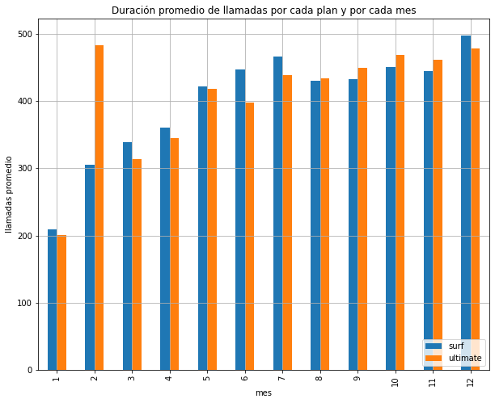
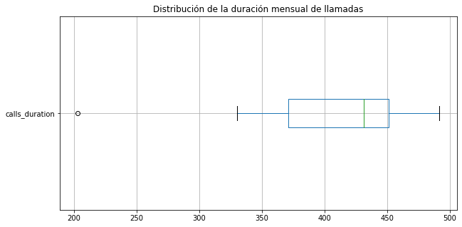
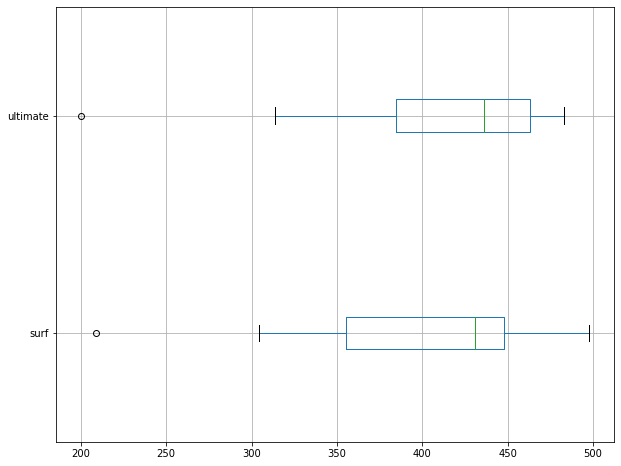
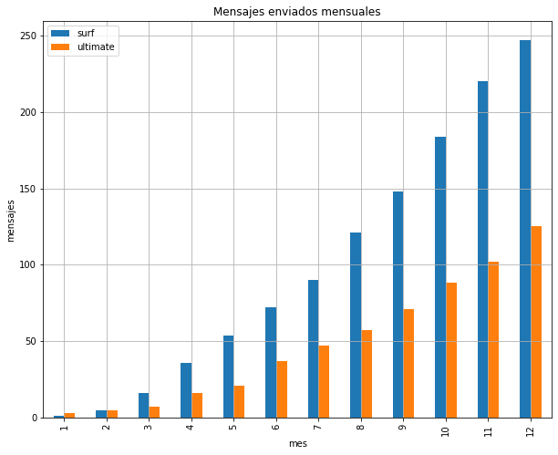
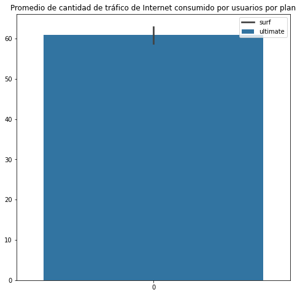
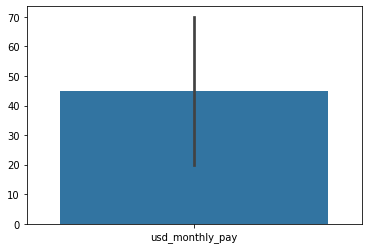
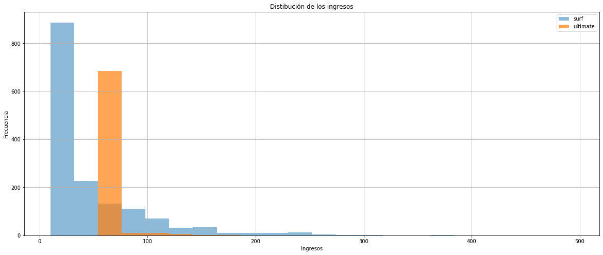

¡Hola!

Mi nombre es Tonatiuh Cruz. Me complace revisar tu proyecto hoy.

Al identificar cualquier error inicialmente, simplemente los destacaré. Te animo a localizar y abordar los problemas de forma independiente como parte de tu preparación para un rol como data-scientist. En un entorno profesional, tu líder de equipo seguiría un enfoque similar. Si encuentras la tarea desafiante, proporcionaré una pista más específica en la próxima iteración.

Encontrarás mis comentarios a continuación - **por favor no los muevas, modifiques o elimines**.

Puedes encontrar mis comentarios en cajas verdes, amarillas o rojas como esta:

<div class="alert alert-block alert-success">
<b>Comentario del revisor</b> <a class="tocSkip"></a>

Éxito. Todo está hecho correctamente.
</div>

<div class="alert alert-block alert-warning">
<b>Comentario del revisor</b> <a class="tocSkip"></a>

Observaciones. Algunas recomendaciones.
</div>

<div class="alert alert-block alert-danger">
<b>Comentario del revisor</b> <a class="tocSkip"></a>

Necesita corrección. El bloque requiere algunas correcciones. El trabajo no puede ser aceptado con comentarios en rojo.
</div>

Puedes responderme utilizando esto:

<div class="alert alert-block alert-info">
<b>Respuesta del estudiante.</b> <a class="tocSkip"></a>

# ¿Cuál es la mejor tarifa?

Trabajas como analista para el operador de telecomunicaciones Megaline. La empresa ofrece a sus clientes dos tarifas de prepago, Surf y Ultimate. El departamento comercial quiere saber cuál de las tarifas genera más ingresos para poder ajustar el presupuesto de publicidad.

Vas a realizar un análisis preliminar de las tarifas basado en una selección de clientes relativamente pequeña. Tendrás los datos de 500 clientes de Megaline: quiénes son los clientes, de dónde son, qué tarifa usan, así como la cantidad de llamadas que hicieron y los mensajes de texto que enviaron en 2018. Tu trabajo es analizar el comportamiento de los clientes y determinar qué tarifa de prepago genera más ingresos.

## Observaciones del proyecto.
- Trabajar con la tabla plans para calcular la tarifa que le corresponde a cada usuarios. Estaba haciendo los calculos sin la ayuda de la tabla.
- Redondear el consumo de gb hacia arriba; como lo hice con los minutos en llamadas
- Donde usé el método groupby, usar el método pivot_table. Con el fin de ponerlo en practica y no se me olvidey corroborar la que la información calculada sea la misma tanto con groupby como con pivot_table.
- Hacer la graficas con librerias seaborn (sns) y pandas (pd)
- Corroborar que SI una los 4 dataframes agrupados calculados con las tablas.
- Usar el método pivot_table. No usar gorupby ni agg, por ahora.
- Declarar la unión de las tablas como merged_part1, merged_part2 & full_merged

## Inicialización


```python
# Carga las librerías
import pandas as pd
import numpy as np
import seaborn as sns
import math
import matplotlib.pyplot as plt
from scipy import stats as st
```

Las liberías necesarias y que podría considerar para este proyecto.

## Cargar datos


```python
# Carga los archivos de datos en diferentes DataFrames
calls = pd.read_csv('/datasets/megaline_calls.csv')
internet = pd.read_csv('/datasets/megaline_internet.csv')
messagges = pd.read_csv('/datasets/megaline_messages.csv')
plans = pd.read_csv('/datasets/megaline_plans.csv')
users = pd.read_csv('/datasets/megaline_users.csv')
```

Se cargaron las 5 tablas necesarias para llevar a acabo este proyecto.

## Preparar los datos

[Los datos para este proyecto se dividen en varias tablas. Explora cada una para tener una comprensión inicial de los datos. Si es necesario, haz las correcciones requeridas en cada tabla.]

### Vizualación de los 5 tablas para asegurarnos que se cargaron correctamente y como están elaboradas.


```python
calls.head()
```


<div>
<style scoped>
    .dataframe tbody tr th:only-of-type {
        vertical-align: middle;
    }

    .dataframe tbody tr th {
        vertical-align: top;
    }

    .dataframe thead th {
        text-align: right;
    }
</style>
<table border="1" class="dataframe">
  <thead>
    <tr style="text-align: right;">
      <th></th>
      <th>id</th>
      <th>user_id</th>
      <th>call_date</th>
      <th>duration</th>
    </tr>
  </thead>
  <tbody>
    <tr>
      <th>0</th>
      <td>1000_93</td>
      <td>1000</td>
      <td>2018-12-27</td>
      <td>8.52</td>
    </tr>
    <tr>
      <th>1</th>
      <td>1000_145</td>
      <td>1000</td>
      <td>2018-12-27</td>
      <td>13.66</td>
    </tr>
    <tr>
      <th>2</th>
      <td>1000_247</td>
      <td>1000</td>
      <td>2018-12-27</td>
      <td>14.48</td>
    </tr>
    <tr>
      <th>3</th>
      <td>1000_309</td>
      <td>1000</td>
      <td>2018-12-28</td>
      <td>5.76</td>
    </tr>
    <tr>
      <th>4</th>
      <td>1000_380</td>
      <td>1000</td>
      <td>2018-12-30</td>
      <td>4.22</td>
    </tr>
  </tbody>
</table>
</div>


```python
internet.head()
```


<div>
<style scoped>
    .dataframe tbody tr th:only-of-type {
        vertical-align: middle;
    }

    .dataframe tbody tr th {
        vertical-align: top;
    }

    .dataframe thead th {
        text-align: right;
    }
</style>
<table border="1" class="dataframe">
  <thead>
    <tr style="text-align: right;">
      <th></th>
      <th>id</th>
      <th>user_id</th>
      <th>session_date</th>
      <th>mb_used</th>
    </tr>
  </thead>
  <tbody>
    <tr>
      <th>0</th>
      <td>1000_13</td>
      <td>1000</td>
      <td>2018-12-29</td>
      <td>89.86</td>
    </tr>
    <tr>
      <th>1</th>
      <td>1000_204</td>
      <td>1000</td>
      <td>2018-12-31</td>
      <td>0.00</td>
    </tr>
    <tr>
      <th>2</th>
      <td>1000_379</td>
      <td>1000</td>
      <td>2018-12-28</td>
      <td>660.40</td>
    </tr>
    <tr>
      <th>3</th>
      <td>1000_413</td>
      <td>1000</td>
      <td>2018-12-26</td>
      <td>270.99</td>
    </tr>
    <tr>
      <th>4</th>
      <td>1000_442</td>
      <td>1000</td>
      <td>2018-12-27</td>
      <td>880.22</td>
    </tr>
  </tbody>
</table>
</div>


```python
messagges.head()
```


<div>
<style scoped>
    .dataframe tbody tr th:only-of-type {
        vertical-align: middle;
    }

    .dataframe tbody tr th {
        vertical-align: top;
    }

    .dataframe thead th {
        text-align: right;
    }
</style>
<table border="1" class="dataframe">
  <thead>
    <tr style="text-align: right;">
      <th></th>
      <th>id</th>
      <th>user_id</th>
      <th>message_date</th>
    </tr>
  </thead>
  <tbody>
    <tr>
      <th>0</th>
      <td>1000_125</td>
      <td>1000</td>
      <td>2018-12-27</td>
    </tr>
    <tr>
      <th>1</th>
      <td>1000_160</td>
      <td>1000</td>
      <td>2018-12-31</td>
    </tr>
    <tr>
      <th>2</th>
      <td>1000_223</td>
      <td>1000</td>
      <td>2018-12-31</td>
    </tr>
    <tr>
      <th>3</th>
      <td>1000_251</td>
      <td>1000</td>
      <td>2018-12-27</td>
    </tr>
    <tr>
      <th>4</th>
      <td>1000_255</td>
      <td>1000</td>
      <td>2018-12-26</td>
    </tr>
  </tbody>
</table>
</div>


```python
plans.head()
```


<div>
<style scoped>
    .dataframe tbody tr th:only-of-type {
        vertical-align: middle;
    }

    .dataframe tbody tr th {
        vertical-align: top;
    }

    .dataframe thead th {
        text-align: right;
    }
</style>
<table border="1" class="dataframe">
  <thead>
    <tr style="text-align: right;">
      <th></th>
      <th>messages_included</th>
      <th>mb_per_month_included</th>
      <th>minutes_included</th>
      <th>usd_monthly_pay</th>
      <th>usd_per_gb</th>
      <th>usd_per_message</th>
      <th>usd_per_minute</th>
      <th>plan_name</th>
    </tr>
  </thead>
  <tbody>
    <tr>
      <th>0</th>
      <td>50</td>
      <td>15360</td>
      <td>500</td>
      <td>20</td>
      <td>10</td>
      <td>0.03</td>
      <td>0.03</td>
      <td>surf</td>
    </tr>
    <tr>
      <th>1</th>
      <td>1000</td>
      <td>30720</td>
      <td>3000</td>
      <td>70</td>
      <td>7</td>
      <td>0.01</td>
      <td>0.01</td>
      <td>ultimate</td>
    </tr>
  </tbody>
</table>
</div>


```python
users.head()
```


<div>
<style scoped>
    .dataframe tbody tr th:only-of-type {
        vertical-align: middle;
    }

    .dataframe tbody tr th {
        vertical-align: top;
    }

    .dataframe thead th {
        text-align: right;
    }
</style>
<table border="1" class="dataframe">
  <thead>
    <tr style="text-align: right;">
      <th></th>
      <th>user_id</th>
      <th>first_name</th>
      <th>last_name</th>
      <th>age</th>
      <th>city</th>
      <th>reg_date</th>
      <th>plan</th>
      <th>churn_date</th>
    </tr>
  </thead>
  <tbody>
    <tr>
      <th>0</th>
      <td>1000</td>
      <td>Anamaria</td>
      <td>Bauer</td>
      <td>45</td>
      <td>Atlanta-Sandy Springs-Roswell, GA MSA</td>
      <td>2018-12-24</td>
      <td>ultimate</td>
      <td>NaN</td>
    </tr>
    <tr>
      <th>1</th>
      <td>1001</td>
      <td>Mickey</td>
      <td>Wilkerson</td>
      <td>28</td>
      <td>Seattle-Tacoma-Bellevue, WA MSA</td>
      <td>2018-08-13</td>
      <td>surf</td>
      <td>NaN</td>
    </tr>
    <tr>
      <th>2</th>
      <td>1002</td>
      <td>Carlee</td>
      <td>Hoffman</td>
      <td>36</td>
      <td>Las Vegas-Henderson-Paradise, NV MSA</td>
      <td>2018-10-21</td>
      <td>surf</td>
      <td>NaN</td>
    </tr>
    <tr>
      <th>3</th>
      <td>1003</td>
      <td>Reynaldo</td>
      <td>Jenkins</td>
      <td>52</td>
      <td>Tulsa, OK MSA</td>
      <td>2018-01-28</td>
      <td>surf</td>
      <td>NaN</td>
    </tr>
    <tr>
      <th>4</th>
      <td>1004</td>
      <td>Leonila</td>
      <td>Thompson</td>
      <td>40</td>
      <td>Seattle-Tacoma-Bellevue, WA MSA</td>
      <td>2018-05-23</td>
      <td>surf</td>
      <td>NaN</td>
    </tr>
  </tbody>
</table>
</div>


### Calculamos la dimensión de las 5 tablas.
Obervamos que no tiene valores nulos, por lo que no es necesario aplicar ningún método para tratar con valores nulos.


```python
calls.info()
```

    <class 'pandas.core.frame.DataFrame'>
    RangeIndex: 137735 entries, 0 to 137734
    Data columns (total 4 columns):
     #   Column     Non-Null Count   Dtype  
    ---  ------     --------------   -----  
     0   id         137735 non-null  object 
     1   user_id    137735 non-null  int64  
     2   call_date  137735 non-null  object 
     3   duration   137735 non-null  float64
    dtypes: float64(1), int64(1), object(2)
    memory usage: 4.2+ MB


```python
internet.info()
```

    <class 'pandas.core.frame.DataFrame'>
    RangeIndex: 104825 entries, 0 to 104824
    Data columns (total 4 columns):
     #   Column        Non-Null Count   Dtype  
    ---  ------        --------------   -----  
     0   id            104825 non-null  object 
     1   user_id       104825 non-null  int64  
     2   session_date  104825 non-null  object 
     3   mb_used       104825 non-null  float64
    dtypes: float64(1), int64(1), object(2)
    memory usage: 3.2+ MB


```python
messagges.info()
```

    <class 'pandas.core.frame.DataFrame'>
    RangeIndex: 76051 entries, 0 to 76050
    Data columns (total 3 columns):
     #   Column        Non-Null Count  Dtype 
    ---  ------        --------------  ----- 
     0   id            76051 non-null  object
     1   user_id       76051 non-null  int64 
     2   message_date  76051 non-null  object
    dtypes: int64(1), object(2)
    memory usage: 1.7+ MB


```python
plans.info()
```

    <class 'pandas.core.frame.DataFrame'>
    RangeIndex: 2 entries, 0 to 1
    Data columns (total 8 columns):
     #   Column                 Non-Null Count  Dtype  
    ---  ------                 --------------  -----  
     0   messages_included      2 non-null      int64  
     1   mb_per_month_included  2 non-null      int64  
     2   minutes_included       2 non-null      int64  
     3   usd_monthly_pay        2 non-null      int64  
     4   usd_per_gb             2 non-null      int64  
     5   usd_per_message        2 non-null      float64
     6   usd_per_minute         2 non-null      float64
     7   plan_name              2 non-null      object 
    dtypes: float64(2), int64(5), object(1)
    memory usage: 256.0+ bytes


```python
users.info()
```

    <class 'pandas.core.frame.DataFrame'>
    RangeIndex: 500 entries, 0 to 499
    Data columns (total 8 columns):
     #   Column      Non-Null Count  Dtype 
    ---  ------      --------------  ----- 
     0   user_id     500 non-null    int64 
     1   first_name  500 non-null    object
     2   last_name   500 non-null    object
     3   age         500 non-null    int64 
     4   city        500 non-null    object
     5   reg_date    500 non-null    object
     6   plan        500 non-null    object
     7   churn_date  34 non-null     object
    dtypes: int64(2), object(6)
    memory usage: 31.4+ KB


### Filas duplicadas
Calculamos en esta sección si en algunas de las tablas hay filas duplicadas. No hay ninguna fila duplicada con le que hay que lidiar.


```python
calls[calls.duplicated()]
```


<div>
<style scoped>
    .dataframe tbody tr th:only-of-type {
        vertical-align: middle;
    }

    .dataframe tbody tr th {
        vertical-align: top;
    }

    .dataframe thead th {
        text-align: right;
    }
</style>
<table border="1" class="dataframe">
  <thead>
    <tr style="text-align: right;">
      <th></th>
      <th>id</th>
      <th>user_id</th>
      <th>call_date</th>
      <th>duration</th>
    </tr>
  </thead>
  <tbody>
  </tbody>
</table>
</div>


```python
internet[internet.duplicated()]
```


<div>
<style scoped>
    .dataframe tbody tr th:only-of-type {
        vertical-align: middle;
    }

    .dataframe tbody tr th {
        vertical-align: top;
    }

    .dataframe thead th {
        text-align: right;
    }
</style>
<table border="1" class="dataframe">
  <thead>
    <tr style="text-align: right;">
      <th></th>
      <th>id</th>
      <th>user_id</th>
      <th>session_date</th>
      <th>mb_used</th>
    </tr>
  </thead>
  <tbody>
  </tbody>
</table>
</div>


```python
messagges[messagges.duplicated()]
```


<div>
<style scoped>
    .dataframe tbody tr th:only-of-type {
        vertical-align: middle;
    }

    .dataframe tbody tr th {
        vertical-align: top;
    }

    .dataframe thead th {
        text-align: right;
    }
</style>
<table border="1" class="dataframe">
  <thead>
    <tr style="text-align: right;">
      <th></th>
      <th>id</th>
      <th>user_id</th>
      <th>message_date</th>
    </tr>
  </thead>
  <tbody>
  </tbody>
</table>
</div>


```python
plans[plans.duplicated()]
```


<div>
<style scoped>
    .dataframe tbody tr th:only-of-type {
        vertical-align: middle;
    }

    .dataframe tbody tr th {
        vertical-align: top;
    }

    .dataframe thead th {
        text-align: right;
    }
</style>
<table border="1" class="dataframe">
  <thead>
    <tr style="text-align: right;">
      <th></th>
      <th>messages_included</th>
      <th>mb_per_month_included</th>
      <th>minutes_included</th>
      <th>usd_monthly_pay</th>
      <th>usd_per_gb</th>
      <th>usd_per_message</th>
      <th>usd_per_minute</th>
      <th>plan_name</th>
    </tr>
  </thead>
  <tbody>
  </tbody>
</table>
</div>


```python
users[users.duplicated()]
```


<div>
<style scoped>
    .dataframe tbody tr th:only-of-type {
        vertical-align: middle;
    }

    .dataframe tbody tr th {
        vertical-align: top;
    }

    .dataframe thead th {
        text-align: right;
    }
</style>
<table border="1" class="dataframe">
  <thead>
    <tr style="text-align: right;">
      <th></th>
      <th>user_id</th>
      <th>first_name</th>
      <th>last_name</th>
      <th>age</th>
      <th>city</th>
      <th>reg_date</th>
      <th>plan</th>
      <th>churn_date</th>
    </tr>
  </thead>
  <tbody>
  </tbody>
</table>
</div>


En esta sección se validaron que los datos se hayan cargado corectamente. Obervamos cuál es el cooumen de cada tabalas y lso valores no nulos que tiene. Al igual que los valores duplicados. El nombre de las columnas también parecen estar con un buen formato

## Tarifas


```python
# Imprime la información general/resumida sobre el DataFrame de las tarifas
plans.info()
```

    <class 'pandas.core.frame.DataFrame'>
    RangeIndex: 2 entries, 0 to 1
    Data columns (total 8 columns):
     #   Column                 Non-Null Count  Dtype  
    ---  ------                 --------------  -----  
     0   messages_included      2 non-null      int64  
     1   mb_per_month_included  2 non-null      int64  
     2   minutes_included       2 non-null      int64  
     3   usd_monthly_pay        2 non-null      int64  
     4   usd_per_gb             2 non-null      int64  
     5   usd_per_message        2 non-null      float64
     6   usd_per_minute         2 non-null      float64
     7   plan_name              2 non-null      object 
    dtypes: float64(2), int64(5), object(1)
    memory usage: 256.0+ bytes


```python
# Imprime una muestra de los datos para las tarifas
plans.sample()
```


<div>
<style scoped>
    .dataframe tbody tr th:only-of-type {
        vertical-align: middle;
    }

    .dataframe tbody tr th {
        vertical-align: top;
    }

    .dataframe thead th {
        text-align: right;
    }
</style>
<table border="1" class="dataframe">
  <thead>
    <tr style="text-align: right;">
      <th></th>
      <th>messages_included</th>
      <th>mb_per_month_included</th>
      <th>minutes_included</th>
      <th>usd_monthly_pay</th>
      <th>usd_per_gb</th>
      <th>usd_per_message</th>
      <th>usd_per_minute</th>
      <th>plan_name</th>
    </tr>
  </thead>
  <tbody>
    <tr>
      <th>1</th>
      <td>1000</td>
      <td>30720</td>
      <td>3000</td>
      <td>70</td>
      <td>7</td>
      <td>0.01</td>
      <td>0.01</td>
      <td>ultimate</td>
    </tr>
  </tbody>
</table>
</div>


```python
plans
```


<div>
<style scoped>
    .dataframe tbody tr th:only-of-type {
        vertical-align: middle;
    }

    .dataframe tbody tr th {
        vertical-align: top;
    }

    .dataframe thead th {
        text-align: right;
    }
</style>
<table border="1" class="dataframe">
  <thead>
    <tr style="text-align: right;">
      <th></th>
      <th>messages_included</th>
      <th>mb_per_month_included</th>
      <th>minutes_included</th>
      <th>usd_monthly_pay</th>
      <th>usd_per_gb</th>
      <th>usd_per_message</th>
      <th>usd_per_minute</th>
      <th>plan_name</th>
    </tr>
  </thead>
  <tbody>
    <tr>
      <th>0</th>
      <td>50</td>
      <td>15360</td>
      <td>500</td>
      <td>20</td>
      <td>10</td>
      <td>0.03</td>
      <td>0.03</td>
      <td>surf</td>
    </tr>
    <tr>
      <th>1</th>
      <td>1000</td>
      <td>30720</td>
      <td>3000</td>
      <td>70</td>
      <td>7</td>
      <td>0.01</td>
      <td>0.01</td>
      <td>ultimate</td>
    </tr>
  </tbody>
</table>
</div>


La tablas `plans` tiene una dimensión de 8 columnas x 2 filas, de las cuales no tienen ningún valor nulo. SIn embargo, podemo decir que si hay valores no adecuados, ya que  Megaline redondea los megabytes a gigabytes, y tenenos una columna, que es `mb_per_month_included` la cantidad de mb mensual que tienen los dos planes.  Por lo tanto se puede crear una columna llamada `gb_per_month_included` que muestra al conversión.

## Corregir datos

[Corrige los problemas obvios con los datos basándote en las observaciones iniciales.]


```python
plans['gb_per_month_included'] = plans['mb_per_month_included'] / 1_024
```

<div class="alert alert-block alert-success">
<b>Comentario del revisor</b> <a class="tocSkip"></a>

Muy buen trabajo!! Es correcto considerar que 1024 megabytes son 1 gigabytes.
    
</div>

<div class="alert alert-block alert-warning">
<b>Comentario revisor</b> <a class="tocSkip"></a>


Te recomiendo usar la función de math.ceil() cuando redondeamos hacia arriba lo valores, dado que si lo que hacemos es transformalos a int solamente eliminamos la parte decimal y para este ejercicio debemos hacer el redondeo superior dado que se cobra el costo extra en cuanto se pasa de los límites.. 
</div>


```python
plans
```


<div>
<style scoped>
    .dataframe tbody tr th:only-of-type {
        vertical-align: middle;
    }

    .dataframe tbody tr th {
        vertical-align: top;
    }

    .dataframe thead th {
        text-align: right;
    }
</style>
<table border="1" class="dataframe">
  <thead>
    <tr style="text-align: right;">
      <th></th>
      <th>messages_included</th>
      <th>mb_per_month_included</th>
      <th>minutes_included</th>
      <th>usd_monthly_pay</th>
      <th>usd_per_gb</th>
      <th>usd_per_message</th>
      <th>usd_per_minute</th>
      <th>plan_name</th>
      <th>gb_per_month_included</th>
    </tr>
  </thead>
  <tbody>
    <tr>
      <th>0</th>
      <td>50</td>
      <td>15360</td>
      <td>500</td>
      <td>20</td>
      <td>10</td>
      <td>0.03</td>
      <td>0.03</td>
      <td>surf</td>
      <td>15.0</td>
    </tr>
    <tr>
      <th>1</th>
      <td>1000</td>
      <td>30720</td>
      <td>3000</td>
      <td>70</td>
      <td>7</td>
      <td>0.01</td>
      <td>0.01</td>
      <td>ultimate</td>
      <td>30.0</td>
    </tr>
  </tbody>
</table>
</div>


Hicimos la conversión de megabytes a gigabytes

## Enriquecer los datos

Lo que puede ser de mucha utilidad y que la tabla sea un poco mas específica es pasar la la columna `plan_name` como índice
    y eliminar la la columna `mb_per_month_included` ya que ya no es necesaria. Al final solo me decidí por eliminar la columna `mb_per_month_included` y no pasar plan_name como índice. Debido a que puede hacerme util para unir dataframes si es necesario.


```python
#plans = plans.set_index('plan_name')
plans = plans.drop(columns=['mb_per_month_included'])
```


```python
plans
```


<div>
<style scoped>
    .dataframe tbody tr th:only-of-type {
        vertical-align: middle;
    }

    .dataframe tbody tr th {
        vertical-align: top;
    }

    .dataframe thead th {
        text-align: right;
    }
</style>
<table border="1" class="dataframe">
  <thead>
    <tr style="text-align: right;">
      <th></th>
      <th>messages_included</th>
      <th>minutes_included</th>
      <th>usd_monthly_pay</th>
      <th>usd_per_gb</th>
      <th>usd_per_message</th>
      <th>usd_per_minute</th>
      <th>plan_name</th>
      <th>gb_per_month_included</th>
    </tr>
  </thead>
  <tbody>
    <tr>
      <th>0</th>
      <td>50</td>
      <td>500</td>
      <td>20</td>
      <td>10</td>
      <td>0.03</td>
      <td>0.03</td>
      <td>surf</td>
      <td>15.0</td>
    </tr>
    <tr>
      <th>1</th>
      <td>1000</td>
      <td>3000</td>
      <td>70</td>
      <td>7</td>
      <td>0.01</td>
      <td>0.01</td>
      <td>ultimate</td>
      <td>30.0</td>
    </tr>
  </tbody>
</table>
</div>


## Usuarios/as


```python
# Imprime la información general/resumida sobre el DataFrame de usuarios
users.info()
```

    <class 'pandas.core.frame.DataFrame'>
    RangeIndex: 500 entries, 0 to 499
    Data columns (total 8 columns):
     #   Column      Non-Null Count  Dtype 
    ---  ------      --------------  ----- 
     0   user_id     500 non-null    int64 
     1   first_name  500 non-null    object
     2   last_name   500 non-null    object
     3   age         500 non-null    int64 
     4   city        500 non-null    object
     5   reg_date    500 non-null    object
     6   plan        500 non-null    object
     7   churn_date  34 non-null     object
    dtypes: int64(2), object(6)
    memory usage: 31.4+ KB


```python
# Imprime una muestra de datos para usuarios

users.sample(5)
```


<div>
<style scoped>
    .dataframe tbody tr th:only-of-type {
        vertical-align: middle;
    }

    .dataframe tbody tr th {
        vertical-align: top;
    }

    .dataframe thead th {
        text-align: right;
    }
</style>
<table border="1" class="dataframe">
  <thead>
    <tr style="text-align: right;">
      <th></th>
      <th>user_id</th>
      <th>first_name</th>
      <th>last_name</th>
      <th>age</th>
      <th>city</th>
      <th>reg_date</th>
      <th>plan</th>
      <th>churn_date</th>
    </tr>
  </thead>
  <tbody>
    <tr>
      <th>71</th>
      <td>1071</td>
      <td>Isa</td>
      <td>Roy</td>
      <td>29</td>
      <td>New York-Newark-Jersey City, NY-NJ-PA MSA</td>
      <td>2018-05-23</td>
      <td>surf</td>
      <td>NaN</td>
    </tr>
    <tr>
      <th>473</th>
      <td>1473</td>
      <td>Kirk</td>
      <td>Velez</td>
      <td>61</td>
      <td>Louisville/Jefferson County, KY-IN MSA</td>
      <td>2018-12-31</td>
      <td>surf</td>
      <td>NaN</td>
    </tr>
    <tr>
      <th>288</th>
      <td>1288</td>
      <td>Jenette</td>
      <td>Rush</td>
      <td>60</td>
      <td>Las Vegas-Henderson-Paradise, NV MSA</td>
      <td>2018-07-18</td>
      <td>surf</td>
      <td>NaN</td>
    </tr>
    <tr>
      <th>62</th>
      <td>1062</td>
      <td>Kristeen</td>
      <td>Head</td>
      <td>41</td>
      <td>San Antonio-New Braunfels, TX MSA</td>
      <td>2018-02-06</td>
      <td>ultimate</td>
      <td>NaN</td>
    </tr>
    <tr>
      <th>412</th>
      <td>1412</td>
      <td>Cortez</td>
      <td>Reese</td>
      <td>61</td>
      <td>Detroit-Warren-Dearborn, MI MSA</td>
      <td>2018-04-08</td>
      <td>ultimate</td>
      <td>NaN</td>
    </tr>
  </tbody>
</table>
</div>


```python
# users['churn_date'].value_counts(dropna=False)
```


```python
nan_values_churn_date = users['churn_date'].isna().sum()
f'Hay {nan_values_churn_date} en la columna churn_date'
```


    'Hay 466 en la columna churn_date'


[Describe lo que ves y observas en la información general y en la muestra de datos impresa para el precio de datos anterior. ¿Hay algún problema (tipos de datos no adecuados, datos ausentes, etc.) que pudieran necesitar investigación y cambios adicionales? ¿Cómo se puede arreglar?]

El df de `users` tiene una dimensión de 8 columnas x 500 filas. La única columna que tiene valores nulos es `churn_date` con 466; si el valor es ausente, la tarifa se estaba usando cuando fue extraída esta base de datos. La mayoría de las columnas son objetos y dos ellos, `reg_date` y `churn_date`, se pueden pasar a formato de fecha.

### Corregir los datos

[Corrige los problemas obvios con los datos basándote en las observaciones iniciales.]


```python
#users['churn_date'] = users['churn_date'].fillna(pd.NaT)
```


```python
users['reg_date'] = pd.to_datetime(users['reg_date'])
users['churn_date'] = pd.to_datetime(users['churn_date'],errors='coerce')
```

<div class="alert alert-block alert-warning">
<b>Comentario Revisor</b> <a class="tocSkip"></a>

En todos los casos en los que cambiamos el tipo de variable a datetime, te recomiendo agregar el argumento "format='%Y-%m-%d'" dentro de la función to_datetime(). De esta manera, puedes asegurarte siempre de que el formato de la fecha que deseas cambiar sea el que necesitas.
</div>


```python
users.info()
```

    <class 'pandas.core.frame.DataFrame'>
    RangeIndex: 500 entries, 0 to 499
    Data columns (total 8 columns):
     #   Column      Non-Null Count  Dtype         
    ---  ------      --------------  -----         
     0   user_id     500 non-null    int64         
     1   first_name  500 non-null    object        
     2   last_name   500 non-null    object        
     3   age         500 non-null    int64         
     4   city        500 non-null    object        
     5   reg_date    500 non-null    datetime64[ns]
     6   plan        500 non-null    object        
     7   churn_date  34 non-null     datetime64[ns]
    dtypes: datetime64[ns](2), int64(2), object(4)
    memory usage: 31.4+ KB


Para pasar a formato fecha en las dos columnas ya anteriormente mencionadas, primero tuve que convertir los valors NaN a NaT (not a time) con el método `fillna` y `atributo pd.NaT`.
Nuavemente consulté la información general del df.

### Enriquecer los datos

[Agrega factores adicionales a los datos si crees que pudieran ser útiles.]


```python
users['full_name'] = users['first_name'] + ' ' + users['last_name']
```


```python
users = users.drop(columns='churn_date')
```


```python
users.sample(5)
```


<div>
<style scoped>
    .dataframe tbody tr th:only-of-type {
        vertical-align: middle;
    }

    .dataframe tbody tr th {
        vertical-align: top;
    }

    .dataframe thead th {
        text-align: right;
    }
</style>
<table border="1" class="dataframe">
  <thead>
    <tr style="text-align: right;">
      <th></th>
      <th>user_id</th>
      <th>first_name</th>
      <th>last_name</th>
      <th>age</th>
      <th>city</th>
      <th>reg_date</th>
      <th>plan</th>
      <th>full_name</th>
    </tr>
  </thead>
  <tbody>
    <tr>
      <th>432</th>
      <td>1432</td>
      <td>Azucena</td>
      <td>Goodwin</td>
      <td>59</td>
      <td>Salt Lake City, UT MSA</td>
      <td>2018-10-03</td>
      <td>ultimate</td>
      <td>Azucena Goodwin</td>
    </tr>
    <tr>
      <th>214</th>
      <td>1214</td>
      <td>Emil</td>
      <td>Robles</td>
      <td>34</td>
      <td>San Francisco-Oakland-Berkeley, CA MSA</td>
      <td>2018-01-01</td>
      <td>ultimate</td>
      <td>Emil Robles</td>
    </tr>
    <tr>
      <th>244</th>
      <td>1244</td>
      <td>Demarcus</td>
      <td>Ellis</td>
      <td>75</td>
      <td>Birmingham-Hoover, AL MSA</td>
      <td>2018-02-05</td>
      <td>surf</td>
      <td>Demarcus Ellis</td>
    </tr>
    <tr>
      <th>152</th>
      <td>1152</td>
      <td>Merrill</td>
      <td>Hogan</td>
      <td>35</td>
      <td>Orlando-Kissimmee-Sanford, FL MSA</td>
      <td>2018-11-01</td>
      <td>surf</td>
      <td>Merrill Hogan</td>
    </tr>
    <tr>
      <th>199</th>
      <td>1199</td>
      <td>Antonetta</td>
      <td>Finley</td>
      <td>39</td>
      <td>San Antonio-New Braunfels, TX MSA</td>
      <td>2018-08-01</td>
      <td>ultimate</td>
      <td>Antonetta Finley</td>
    </tr>
  </tbody>
</table>
</div>


Lo que se me ocurrió a agregar es una columna que muestre el nombre completo y eliminar la columns `churn_date`.
En todo los demás me parece que no es necesario hacer ningún otro cambio.

<div class="alert alert-block alert-warning">
<b>Comentario Revisor</b> <a class="tocSkip"></a>

Muy buena conclusión, pero a manera de complementar el análisis qué podríamos decir de los registros que no tienen valores en la variable churn_date?
</div>

## Llamadas


```python
# Imprime la información general/resumida sobre el DataFrame de las llamadas
calls.info()
```

    <class 'pandas.core.frame.DataFrame'>
    RangeIndex: 137735 entries, 0 to 137734
    Data columns (total 4 columns):
     #   Column     Non-Null Count   Dtype  
    ---  ------     --------------   -----  
     0   id         137735 non-null  object 
     1   user_id    137735 non-null  int64  
     2   call_date  137735 non-null  object 
     3   duration   137735 non-null  float64
    dtypes: float64(1), int64(1), object(2)
    memory usage: 4.2+ MB


```python
# Imprime una muestra de datos para las llamadas
calls.sample(20,random_state=7659)
```


<div>
<style scoped>
    .dataframe tbody tr th:only-of-type {
        vertical-align: middle;
    }

    .dataframe tbody tr th {
        vertical-align: top;
    }

    .dataframe thead th {
        text-align: right;
    }
</style>
<table border="1" class="dataframe">
  <thead>
    <tr style="text-align: right;">
      <th></th>
      <th>id</th>
      <th>user_id</th>
      <th>call_date</th>
      <th>duration</th>
    </tr>
  </thead>
  <tbody>
    <tr>
      <th>4740</th>
      <td>1022_6</td>
      <td>1022</td>
      <td>2018-08-19</td>
      <td>0.00</td>
    </tr>
    <tr>
      <th>94987</th>
      <td>1336_938</td>
      <td>1336</td>
      <td>2018-11-13</td>
      <td>0.00</td>
    </tr>
    <tr>
      <th>76871</th>
      <td>1276_131</td>
      <td>1276</td>
      <td>2018-10-31</td>
      <td>0.00</td>
    </tr>
    <tr>
      <th>67248</th>
      <td>1241_84</td>
      <td>1241</td>
      <td>2018-10-16</td>
      <td>10.26</td>
    </tr>
    <tr>
      <th>78334</th>
      <td>1280_391</td>
      <td>1280</td>
      <td>2018-10-31</td>
      <td>2.44</td>
    </tr>
    <tr>
      <th>59001</th>
      <td>1214_70</td>
      <td>1214</td>
      <td>2018-03-25</td>
      <td>1.76</td>
    </tr>
    <tr>
      <th>83787</th>
      <td>1305_236</td>
      <td>1305</td>
      <td>2018-11-22</td>
      <td>0.00</td>
    </tr>
    <tr>
      <th>67991</th>
      <td>1246_10</td>
      <td>1246</td>
      <td>2018-03-12</td>
      <td>0.00</td>
    </tr>
    <tr>
      <th>133251</th>
      <td>1483_26</td>
      <td>1483</td>
      <td>2018-08-01</td>
      <td>9.54</td>
    </tr>
    <tr>
      <th>73564</th>
      <td>1261_324</td>
      <td>1261</td>
      <td>2018-12-21</td>
      <td>9.74</td>
    </tr>
    <tr>
      <th>124600</th>
      <td>1440_116</td>
      <td>1440</td>
      <td>2018-10-23</td>
      <td>8.03</td>
    </tr>
    <tr>
      <th>48101</th>
      <td>1174_78</td>
      <td>1174</td>
      <td>2018-06-03</td>
      <td>3.08</td>
    </tr>
    <tr>
      <th>42254</th>
      <td>1155_219</td>
      <td>1155</td>
      <td>2018-04-12</td>
      <td>3.49</td>
    </tr>
    <tr>
      <th>112774</th>
      <td>1397_420</td>
      <td>1397</td>
      <td>2018-06-11</td>
      <td>21.97</td>
    </tr>
    <tr>
      <th>57425</th>
      <td>1206_175</td>
      <td>1206</td>
      <td>2018-08-11</td>
      <td>3.55</td>
    </tr>
    <tr>
      <th>86556</th>
      <td>1320_225</td>
      <td>1320</td>
      <td>2018-12-02</td>
      <td>22.85</td>
    </tr>
    <tr>
      <th>57991</th>
      <td>1209_507</td>
      <td>1209</td>
      <td>2018-10-31</td>
      <td>3.38</td>
    </tr>
    <tr>
      <th>8362</th>
      <td>1039_302</td>
      <td>1039</td>
      <td>2018-06-20</td>
      <td>8.03</td>
    </tr>
    <tr>
      <th>125488</th>
      <td>1444_18</td>
      <td>1444</td>
      <td>2018-10-16</td>
      <td>9.54</td>
    </tr>
    <tr>
      <th>106841</th>
      <td>1379_39</td>
      <td>1379</td>
      <td>2018-12-16</td>
      <td>4.74</td>
    </tr>
  </tbody>
</table>
</div>


<font color='blue'>
Viendo la información general, no hay valores nulos. Sin embargo; observé que se registraron llamadas con una duración de 0.00 segundos. Usuarios colgaron a la velocidad de la luz justo en el momento en el que empezó el cronómetro de la llamada ¿Se cobran o no se cobran? Como es un registró tomaré que sí se cobran. Adicional, es algo que se debería aclarar con la empresa, bueno es no es nuestro análisis.
Otro dato curioso que note es que el id de la llamada es un objeto debido al gión bajo (_)
    </font>

### Corregir los datos

[Corrige los problemas obvios con los datos basándote en las observaciones iniciales.]


```python
#Redondeo hacia arriba
calls['duration'] = np.ceil(calls['duration'])
```


```python
#Sustuir lo valores 0 con 1
calls['duration'] = calls['duration'].where(~(calls['duration'] == 0),1)
```


```python
#Pasar a entero la columna duration
calls['duration'] = calls['duration'].astype('int')
```


```python
#Cambiar el formato a datetime la columna call_date
calls['call_date'] = pd.to_datetime(calls['call_date'])
```


```python
calls.sample(20,random_state=7659)
```


<div>
<style scoped>
    .dataframe tbody tr th:only-of-type {
        vertical-align: middle;
    }

    .dataframe tbody tr th {
        vertical-align: top;
    }

    .dataframe thead th {
        text-align: right;
    }
</style>
<table border="1" class="dataframe">
  <thead>
    <tr style="text-align: right;">
      <th></th>
      <th>id</th>
      <th>user_id</th>
      <th>call_date</th>
      <th>duration</th>
    </tr>
  </thead>
  <tbody>
    <tr>
      <th>4740</th>
      <td>1022_6</td>
      <td>1022</td>
      <td>2018-08-19</td>
      <td>1</td>
    </tr>
    <tr>
      <th>94987</th>
      <td>1336_938</td>
      <td>1336</td>
      <td>2018-11-13</td>
      <td>1</td>
    </tr>
    <tr>
      <th>76871</th>
      <td>1276_131</td>
      <td>1276</td>
      <td>2018-10-31</td>
      <td>1</td>
    </tr>
    <tr>
      <th>67248</th>
      <td>1241_84</td>
      <td>1241</td>
      <td>2018-10-16</td>
      <td>11</td>
    </tr>
    <tr>
      <th>78334</th>
      <td>1280_391</td>
      <td>1280</td>
      <td>2018-10-31</td>
      <td>3</td>
    </tr>
    <tr>
      <th>59001</th>
      <td>1214_70</td>
      <td>1214</td>
      <td>2018-03-25</td>
      <td>2</td>
    </tr>
    <tr>
      <th>83787</th>
      <td>1305_236</td>
      <td>1305</td>
      <td>2018-11-22</td>
      <td>1</td>
    </tr>
    <tr>
      <th>67991</th>
      <td>1246_10</td>
      <td>1246</td>
      <td>2018-03-12</td>
      <td>1</td>
    </tr>
    <tr>
      <th>133251</th>
      <td>1483_26</td>
      <td>1483</td>
      <td>2018-08-01</td>
      <td>10</td>
    </tr>
    <tr>
      <th>73564</th>
      <td>1261_324</td>
      <td>1261</td>
      <td>2018-12-21</td>
      <td>10</td>
    </tr>
    <tr>
      <th>124600</th>
      <td>1440_116</td>
      <td>1440</td>
      <td>2018-10-23</td>
      <td>9</td>
    </tr>
    <tr>
      <th>48101</th>
      <td>1174_78</td>
      <td>1174</td>
      <td>2018-06-03</td>
      <td>4</td>
    </tr>
    <tr>
      <th>42254</th>
      <td>1155_219</td>
      <td>1155</td>
      <td>2018-04-12</td>
      <td>4</td>
    </tr>
    <tr>
      <th>112774</th>
      <td>1397_420</td>
      <td>1397</td>
      <td>2018-06-11</td>
      <td>22</td>
    </tr>
    <tr>
      <th>57425</th>
      <td>1206_175</td>
      <td>1206</td>
      <td>2018-08-11</td>
      <td>4</td>
    </tr>
    <tr>
      <th>86556</th>
      <td>1320_225</td>
      <td>1320</td>
      <td>2018-12-02</td>
      <td>23</td>
    </tr>
    <tr>
      <th>57991</th>
      <td>1209_507</td>
      <td>1209</td>
      <td>2018-10-31</td>
      <td>4</td>
    </tr>
    <tr>
      <th>8362</th>
      <td>1039_302</td>
      <td>1039</td>
      <td>2018-06-20</td>
      <td>9</td>
    </tr>
    <tr>
      <th>125488</th>
      <td>1444_18</td>
      <td>1444</td>
      <td>2018-10-16</td>
      <td>10</td>
    </tr>
    <tr>
      <th>106841</th>
      <td>1379_39</td>
      <td>1379</td>
      <td>2018-12-16</td>
      <td>5</td>
    </tr>
  </tbody>
</table>
</div>


```python
calls.info()
```

    <class 'pandas.core.frame.DataFrame'>
    RangeIndex: 137735 entries, 0 to 137734
    Data columns (total 4 columns):
     #   Column     Non-Null Count   Dtype         
    ---  ------     --------------   -----         
     0   id         137735 non-null  object        
     1   user_id    137735 non-null  int64         
     2   call_date  137735 non-null  datetime64[ns]
     3   duration   137735 non-null  int64         
    dtypes: datetime64[ns](1), int64(2), object(1)
    memory usage: 4.2+ MB


<font color='blue'>
En la columna *duration*, para cambiar el valor de flotante a entero, se redonde hacia arriba los decimales y se sustituyeron los valores de 0 a 1.
Posteriormente, cambié el formato fecha la columna *call_date*.
Finalmente, corroboré nuevamente la información general para observar los cambios mencionados.
    </font>

### Enriquecer los datos

[Agrega factores adicionales a los datos si crees que pudieran ser útiles.]


```python
#Dividimos el id para solo tener el numerod de la derecha
new_id = calls['id'].str.split('_', expand=True).rename(columns={1:'new_id'})['new_id']
```


```python
#Creo una nueva columna en calls
calls['id_call'] = new_id
```


```python
calls['id_call'] = calls['id_call'].astype('int')
```


```python
calls.info()
```

    <class 'pandas.core.frame.DataFrame'>
    RangeIndex: 137735 entries, 0 to 137734
    Data columns (total 5 columns):
     #   Column     Non-Null Count   Dtype         
    ---  ------     --------------   -----         
     0   id         137735 non-null  object        
     1   user_id    137735 non-null  int64         
     2   call_date  137735 non-null  datetime64[ns]
     3   duration   137735 non-null  int64         
     4   id_call    137735 non-null  int64         
    dtypes: datetime64[ns](1), int64(3), object(1)
    memory usage: 5.3+ MB


```python
#Funcion quitar el user_id y _
def split_id(data,column_name=''):
    return data.str.split('_', expand=True).rename(columns={1:column_name})[column_name]
```

<font color='blue'>
Lo que hice para poder enriquecer los datos es dividir el id de llamada. La fórmula para crear el id es: user_id + '_' + id_call. Aqui creamos una columna donde solo tenga el número que está después del guión bajo. La columna se llama id_call y no borramos la original; id. Además la columna id_call podemos convertirla a entero.
Una observación es que esto debemos hacerlo en todo los dataframes, que tenga el id de esa forma asi que vamos a crear una función llamada split_id.
    </font>

## Mensajes


```python
# Imprime la información general/resumida sobre el DataFrame de los mensajes
messagges.info()
```

    <class 'pandas.core.frame.DataFrame'>
    RangeIndex: 76051 entries, 0 to 76050
    Data columns (total 3 columns):
     #   Column        Non-Null Count  Dtype 
    ---  ------        --------------  ----- 
     0   id            76051 non-null  object
     1   user_id       76051 non-null  int64 
     2   message_date  76051 non-null  object
    dtypes: int64(1), object(2)
    memory usage: 1.7+ MB


```python
# Imprime una muestra de datos para los mensajes
messagges.sample(20,random_state=67598)
```


<div>
<style scoped>
    .dataframe tbody tr th:only-of-type {
        vertical-align: middle;
    }

    .dataframe tbody tr th {
        vertical-align: top;
    }

    .dataframe thead th {
        text-align: right;
    }
</style>
<table border="1" class="dataframe">
  <thead>
    <tr style="text-align: right;">
      <th></th>
      <th>id</th>
      <th>user_id</th>
      <th>message_date</th>
    </tr>
  </thead>
  <tbody>
    <tr>
      <th>10069</th>
      <td>1076_171</td>
      <td>1076</td>
      <td>2018-10-29</td>
    </tr>
    <tr>
      <th>47326</th>
      <td>1324_39</td>
      <td>1324</td>
      <td>2018-12-02</td>
    </tr>
    <tr>
      <th>16614</th>
      <td>1111_107</td>
      <td>1111</td>
      <td>2018-12-07</td>
    </tr>
    <tr>
      <th>37067</th>
      <td>1247_231</td>
      <td>1247</td>
      <td>2018-08-14</td>
    </tr>
    <tr>
      <th>29614</th>
      <td>1183_9</td>
      <td>1183</td>
      <td>2018-11-15</td>
    </tr>
    <tr>
      <th>46598</th>
      <td>1316_526</td>
      <td>1316</td>
      <td>2018-11-21</td>
    </tr>
    <tr>
      <th>32201</th>
      <td>1199_444</td>
      <td>1199</td>
      <td>2018-10-07</td>
    </tr>
    <tr>
      <th>67171</th>
      <td>1435_209</td>
      <td>1435</td>
      <td>2018-11-25</td>
    </tr>
    <tr>
      <th>74377</th>
      <td>1476_142</td>
      <td>1476</td>
      <td>2018-11-22</td>
    </tr>
    <tr>
      <th>44482</th>
      <td>1295_183</td>
      <td>1295</td>
      <td>2018-12-10</td>
    </tr>
    <tr>
      <th>26648</th>
      <td>1162_24</td>
      <td>1162</td>
      <td>2018-12-12</td>
    </tr>
    <tr>
      <th>67111</th>
      <td>1435_149</td>
      <td>1435</td>
      <td>2018-11-26</td>
    </tr>
    <tr>
      <th>25711</th>
      <td>1155_73</td>
      <td>1155</td>
      <td>2018-03-23</td>
    </tr>
    <tr>
      <th>14771</th>
      <td>1100_93</td>
      <td>1100</td>
      <td>2018-11-24</td>
    </tr>
    <tr>
      <th>25697</th>
      <td>1155_59</td>
      <td>1155</td>
      <td>2018-05-06</td>
    </tr>
    <tr>
      <th>16747</th>
      <td>1111_251</td>
      <td>1111</td>
      <td>2018-12-13</td>
    </tr>
    <tr>
      <th>59153</th>
      <td>1374_327</td>
      <td>1374</td>
      <td>2018-08-14</td>
    </tr>
    <tr>
      <th>61381</th>
      <td>1384_498</td>
      <td>1384</td>
      <td>2018-07-02</td>
    </tr>
    <tr>
      <th>46696</th>
      <td>1318_74</td>
      <td>1318</td>
      <td>2018-10-28</td>
    </tr>
    <tr>
      <th>53812</th>
      <td>1341_88</td>
      <td>1341</td>
      <td>2018-11-25</td>
    </tr>
  </tbody>
</table>
</div>


<font color='blue'>
La información es parecida a los dataframes anteriores. Hay una columna que se puede convertir en formato de fecha y crear una columna para el nuevo id de los mensajes.
    </font>

### Corregir los datos

[Corrige los problemas obvios con los datos basándote en las observaciones iniciales.]


```python
messagges['message_date'] = pd.to_datetime(messagges['message_date'])
```


```python
messagges.sample(20,random_state=67598)
```


<div>
<style scoped>
    .dataframe tbody tr th:only-of-type {
        vertical-align: middle;
    }

    .dataframe tbody tr th {
        vertical-align: top;
    }

    .dataframe thead th {
        text-align: right;
    }
</style>
<table border="1" class="dataframe">
  <thead>
    <tr style="text-align: right;">
      <th></th>
      <th>id</th>
      <th>user_id</th>
      <th>message_date</th>
    </tr>
  </thead>
  <tbody>
    <tr>
      <th>10069</th>
      <td>1076_171</td>
      <td>1076</td>
      <td>2018-10-29</td>
    </tr>
    <tr>
      <th>47326</th>
      <td>1324_39</td>
      <td>1324</td>
      <td>2018-12-02</td>
    </tr>
    <tr>
      <th>16614</th>
      <td>1111_107</td>
      <td>1111</td>
      <td>2018-12-07</td>
    </tr>
    <tr>
      <th>37067</th>
      <td>1247_231</td>
      <td>1247</td>
      <td>2018-08-14</td>
    </tr>
    <tr>
      <th>29614</th>
      <td>1183_9</td>
      <td>1183</td>
      <td>2018-11-15</td>
    </tr>
    <tr>
      <th>46598</th>
      <td>1316_526</td>
      <td>1316</td>
      <td>2018-11-21</td>
    </tr>
    <tr>
      <th>32201</th>
      <td>1199_444</td>
      <td>1199</td>
      <td>2018-10-07</td>
    </tr>
    <tr>
      <th>67171</th>
      <td>1435_209</td>
      <td>1435</td>
      <td>2018-11-25</td>
    </tr>
    <tr>
      <th>74377</th>
      <td>1476_142</td>
      <td>1476</td>
      <td>2018-11-22</td>
    </tr>
    <tr>
      <th>44482</th>
      <td>1295_183</td>
      <td>1295</td>
      <td>2018-12-10</td>
    </tr>
    <tr>
      <th>26648</th>
      <td>1162_24</td>
      <td>1162</td>
      <td>2018-12-12</td>
    </tr>
    <tr>
      <th>67111</th>
      <td>1435_149</td>
      <td>1435</td>
      <td>2018-11-26</td>
    </tr>
    <tr>
      <th>25711</th>
      <td>1155_73</td>
      <td>1155</td>
      <td>2018-03-23</td>
    </tr>
    <tr>
      <th>14771</th>
      <td>1100_93</td>
      <td>1100</td>
      <td>2018-11-24</td>
    </tr>
    <tr>
      <th>25697</th>
      <td>1155_59</td>
      <td>1155</td>
      <td>2018-05-06</td>
    </tr>
    <tr>
      <th>16747</th>
      <td>1111_251</td>
      <td>1111</td>
      <td>2018-12-13</td>
    </tr>
    <tr>
      <th>59153</th>
      <td>1374_327</td>
      <td>1374</td>
      <td>2018-08-14</td>
    </tr>
    <tr>
      <th>61381</th>
      <td>1384_498</td>
      <td>1384</td>
      <td>2018-07-02</td>
    </tr>
    <tr>
      <th>46696</th>
      <td>1318_74</td>
      <td>1318</td>
      <td>2018-10-28</td>
    </tr>
    <tr>
      <th>53812</th>
      <td>1341_88</td>
      <td>1341</td>
      <td>2018-11-25</td>
    </tr>
  </tbody>
</table>
</div>


### Enriquecer los datos

[Agrega factores adicionales a los datos si crees que pudieran ser útiles.]


```python
messagges['id_messagges'] = split_id(messagges['id'])
messagges['id_messagges'] = messagges['id_messagges'].astype('int')
```


```python
messagges.sample(5,random_state=67598)
```


<div>
<style scoped>
    .dataframe tbody tr th:only-of-type {
        vertical-align: middle;
    }

    .dataframe tbody tr th {
        vertical-align: top;
    }

    .dataframe thead th {
        text-align: right;
    }
</style>
<table border="1" class="dataframe">
  <thead>
    <tr style="text-align: right;">
      <th></th>
      <th>id</th>
      <th>user_id</th>
      <th>message_date</th>
      <th>id_messagges</th>
    </tr>
  </thead>
  <tbody>
    <tr>
      <th>10069</th>
      <td>1076_171</td>
      <td>1076</td>
      <td>2018-10-29</td>
      <td>171</td>
    </tr>
    <tr>
      <th>47326</th>
      <td>1324_39</td>
      <td>1324</td>
      <td>2018-12-02</td>
      <td>39</td>
    </tr>
    <tr>
      <th>16614</th>
      <td>1111_107</td>
      <td>1111</td>
      <td>2018-12-07</td>
      <td>107</td>
    </tr>
    <tr>
      <th>37067</th>
      <td>1247_231</td>
      <td>1247</td>
      <td>2018-08-14</td>
      <td>231</td>
    </tr>
    <tr>
      <th>29614</th>
      <td>1183_9</td>
      <td>1183</td>
      <td>2018-11-15</td>
      <td>9</td>
    </tr>
  </tbody>
</table>
</div>


```python
messagges.info()
```

    <class 'pandas.core.frame.DataFrame'>
    RangeIndex: 76051 entries, 0 to 76050
    Data columns (total 4 columns):
     #   Column        Non-Null Count  Dtype         
    ---  ------        --------------  -----         
     0   id            76051 non-null  object        
     1   user_id       76051 non-null  int64         
     2   message_date  76051 non-null  datetime64[ns]
     3   id_messagges  76051 non-null  int64         
    dtypes: datetime64[ns](1), int64(2), object(1)
    memory usage: 2.3+ MB


<font color='blue'>
Como mencioné en un puntos anteriores, podemos crear una columna para tener un id mas claro. el nuevo id de mensajes es id_messages
    </font>

## Internet


```python
# Imprime la información general/resumida sobre el DataFrame de internet
internet.info()
```

    <class 'pandas.core.frame.DataFrame'>
    RangeIndex: 104825 entries, 0 to 104824
    Data columns (total 4 columns):
     #   Column        Non-Null Count   Dtype  
    ---  ------        --------------   -----  
     0   id            104825 non-null  object 
     1   user_id       104825 non-null  int64  
     2   session_date  104825 non-null  object 
     3   mb_used       104825 non-null  float64
    dtypes: float64(1), int64(1), object(2)
    memory usage: 3.2+ MB


```python
# Imprime una muestra de datos para el tráfico de internet
internet.sample(12,random_state=76569)
```


<div>
<style scoped>
    .dataframe tbody tr th:only-of-type {
        vertical-align: middle;
    }

    .dataframe tbody tr th {
        vertical-align: top;
    }

    .dataframe thead th {
        text-align: right;
    }
</style>
<table border="1" class="dataframe">
  <thead>
    <tr style="text-align: right;">
      <th></th>
      <th>id</th>
      <th>user_id</th>
      <th>session_date</th>
      <th>mb_used</th>
    </tr>
  </thead>
  <tbody>
    <tr>
      <th>70285</th>
      <td>1328_244</td>
      <td>1328</td>
      <td>2018-06-16</td>
      <td>428.11</td>
    </tr>
    <tr>
      <th>87523</th>
      <td>1405_328</td>
      <td>1405</td>
      <td>2018-11-28</td>
      <td>104.47</td>
    </tr>
    <tr>
      <th>44811</th>
      <td>1198_185</td>
      <td>1198</td>
      <td>2018-10-26</td>
      <td>379.37</td>
    </tr>
    <tr>
      <th>65526</th>
      <td>1302_72</td>
      <td>1302</td>
      <td>2018-11-19</td>
      <td>251.83</td>
    </tr>
    <tr>
      <th>96618</th>
      <td>1454_74</td>
      <td>1454</td>
      <td>2018-08-07</td>
      <td>228.77</td>
    </tr>
    <tr>
      <th>101904</th>
      <td>1488_315</td>
      <td>1488</td>
      <td>2018-05-23</td>
      <td>325.04</td>
    </tr>
    <tr>
      <th>21771</th>
      <td>1099_526</td>
      <td>1099</td>
      <td>2018-12-16</td>
      <td>229.69</td>
    </tr>
    <tr>
      <th>5960</th>
      <td>1033_21</td>
      <td>1033</td>
      <td>2018-11-26</td>
      <td>631.07</td>
    </tr>
    <tr>
      <th>81788</th>
      <td>1383_366</td>
      <td>1383</td>
      <td>2018-11-06</td>
      <td>108.66</td>
    </tr>
    <tr>
      <th>17562</th>
      <td>1079_167</td>
      <td>1079</td>
      <td>2018-08-28</td>
      <td>839.55</td>
    </tr>
    <tr>
      <th>13176</th>
      <td>1062_146</td>
      <td>1062</td>
      <td>2018-12-27</td>
      <td>266.38</td>
    </tr>
    <tr>
      <th>21709</th>
      <td>1099_464</td>
      <td>1099</td>
      <td>2018-03-23</td>
      <td>266.24</td>
    </tr>
  </tbody>
</table>
</div>


<font color='blue'>
En este df, lo único considerable es crea el nuevo id sin el guión bajo, cambiar el formato fecha, y hacer la conversión de Megas a Gigas
    </font>

### Corregir los datos

[Corrige los problemas obvios con los datos basándote en las observaciones iniciales.]


```python
internet['session_date'] = pd.to_datetime(internet['session_date'])
internet['gb_used'] = internet['mb_used'] / 1_024
internet['id_internet'] = split_id(internet['id'])
internet['id_internet'] = internet['id_internet'].astype('int')
```


```python
internet.sample(12)
```


<div>
<style scoped>
    .dataframe tbody tr th:only-of-type {
        vertical-align: middle;
    }

    .dataframe tbody tr th {
        vertical-align: top;
    }

    .dataframe thead th {
        text-align: right;
    }
</style>
<table border="1" class="dataframe">
  <thead>
    <tr style="text-align: right;">
      <th></th>
      <th>id</th>
      <th>user_id</th>
      <th>session_date</th>
      <th>mb_used</th>
      <th>gb_used</th>
      <th>id_internet</th>
    </tr>
  </thead>
  <tbody>
    <tr>
      <th>42493</th>
      <td>1188_138</td>
      <td>1188</td>
      <td>2018-12-16</td>
      <td>439.15</td>
      <td>0.428857</td>
      <td>138</td>
    </tr>
    <tr>
      <th>103040</th>
      <td>1493_158</td>
      <td>1493</td>
      <td>2018-09-16</td>
      <td>666.85</td>
      <td>0.651221</td>
      <td>158</td>
    </tr>
    <tr>
      <th>88063</th>
      <td>1406_380</td>
      <td>1406</td>
      <td>2018-12-08</td>
      <td>262.37</td>
      <td>0.256221</td>
      <td>380</td>
    </tr>
    <tr>
      <th>74181</th>
      <td>1347_276</td>
      <td>1347</td>
      <td>2018-09-24</td>
      <td>404.56</td>
      <td>0.395078</td>
      <td>276</td>
    </tr>
    <tr>
      <th>30164</th>
      <td>1138_400</td>
      <td>1138</td>
      <td>2018-04-20</td>
      <td>158.97</td>
      <td>0.155244</td>
      <td>400</td>
    </tr>
    <tr>
      <th>80556</th>
      <td>1376_109</td>
      <td>1376</td>
      <td>2018-12-12</td>
      <td>201.67</td>
      <td>0.196943</td>
      <td>109</td>
    </tr>
    <tr>
      <th>1185</th>
      <td>1007_169</td>
      <td>1007</td>
      <td>2018-11-06</td>
      <td>766.62</td>
      <td>0.748652</td>
      <td>169</td>
    </tr>
    <tr>
      <th>30134</th>
      <td>1138_367</td>
      <td>1138</td>
      <td>2018-06-11</td>
      <td>366.54</td>
      <td>0.357949</td>
      <td>367</td>
    </tr>
    <tr>
      <th>46765</th>
      <td>1207_104</td>
      <td>1207</td>
      <td>2018-12-30</td>
      <td>273.33</td>
      <td>0.266924</td>
      <td>104</td>
    </tr>
    <tr>
      <th>6582</th>
      <td>1038_70</td>
      <td>1038</td>
      <td>2018-11-23</td>
      <td>677.64</td>
      <td>0.661758</td>
      <td>70</td>
    </tr>
    <tr>
      <th>10032</th>
      <td>1050_455</td>
      <td>1050</td>
      <td>2018-10-13</td>
      <td>118.81</td>
      <td>0.116025</td>
      <td>455</td>
    </tr>
    <tr>
      <th>34743</th>
      <td>1156_340</td>
      <td>1156</td>
      <td>2018-08-29</td>
      <td>6.86</td>
      <td>0.006699</td>
      <td>340</td>
    </tr>
  </tbody>
</table>
</div>


### Enriquecer los datos

[Agrega factores adicionales a los datos si crees que pudieran ser útiles.]


```python
internet.info()
```

    <class 'pandas.core.frame.DataFrame'>
    RangeIndex: 104825 entries, 0 to 104824
    Data columns (total 6 columns):
     #   Column        Non-Null Count   Dtype         
    ---  ------        --------------   -----         
     0   id            104825 non-null  object        
     1   user_id       104825 non-null  int64         
     2   session_date  104825 non-null  datetime64[ns]
     3   mb_used       104825 non-null  float64       
     4   gb_used       104825 non-null  float64       
     5   id_internet   104825 non-null  int64         
    dtypes: datetime64[ns](1), float64(2), int64(2), object(1)
    memory usage: 4.8+ MB


<font color='blue'>
Corroboramos la información general para asegurarnos de los cambios establecidos
    </font>

## Estudiar las condiciones de las tarifas

[Es sumamente importante entender cómo funcionan las tarifas, cómo se les cobra a los usuarios en función de su plan de suscripción. Así que te sugerimos imprimir la información de la tarifa para ver una vez más sus condiciones.]


```python
# Imprime las condiciones de la tarifa y asegúrate de que te quedan claras
plans
```


<div>
<style scoped>
    .dataframe tbody tr th:only-of-type {
        vertical-align: middle;
    }

    .dataframe tbody tr th {
        vertical-align: top;
    }

    .dataframe thead th {
        text-align: right;
    }
</style>
<table border="1" class="dataframe">
  <thead>
    <tr style="text-align: right;">
      <th></th>
      <th>messages_included</th>
      <th>minutes_included</th>
      <th>usd_monthly_pay</th>
      <th>usd_per_gb</th>
      <th>usd_per_message</th>
      <th>usd_per_minute</th>
      <th>plan_name</th>
      <th>gb_per_month_included</th>
    </tr>
  </thead>
  <tbody>
    <tr>
      <th>0</th>
      <td>50</td>
      <td>500</td>
      <td>20</td>
      <td>10</td>
      <td>0.03</td>
      <td>0.03</td>
      <td>surf</td>
      <td>15.0</td>
    </tr>
    <tr>
      <th>1</th>
      <td>1000</td>
      <td>3000</td>
      <td>70</td>
      <td>7</td>
      <td>0.01</td>
      <td>0.01</td>
      <td>ultimate</td>
      <td>30.0</td>
    </tr>
  </tbody>
</table>
</div>


<font color='blue'>
La tabla plans (datos sobre las tarifas):
 
plan_name: nombre de la tarifa.
usd_monthly_pay: pago mensual en dólares estadounidenses.
minutes_included: minutos incluidos al mes (calls).
messages_included: SMS incluidos al mes.
gb_per_month_included: datos incluidos al mes (en gigabytes).
usd_per_minute: precio por minuto tras exceder los límites del paquete (por ejemplo, si el paquete incluye 100 minutos, el operador cobrará el minuto 101).
usd_per_message: precio por SMS tras exceder los límites del paquete.
usd_per_gb: precio por gigabyte de los datos extra tras exceder los límites del paquete (1 GB = 1024 megabytes).
    </font>

## Agregar datos por usuario

[Ahora que los datos están limpios, agrega los datos por usuario y por periodo para que solo haya un registro por usuario y por periodo. Esto facilitará mucho el análisis posterior.]


```python
# Calcula el número de llamadas hechas por cada usuario al mes. Guarda el resultado.
calls['month'] = calls['call_date'].dt.month #Extraer el mes de la columna call_date
# #con el método group_by
# grp_calls = calls.groupby(['user_id','call_date_month'])
# calls_per_user = grp_calls.count()[['id_call']].sort_values(by='id_call',ascending=False)
# calls_per_user
#con el método pivot_table
calls_per_user = pd.pivot_table(calls, values='id_call', 
               index=['user_id','month'], 
                aggfunc='count').sort_values(by='id_call',ascending=False).reset_index()
calls_per_user
```


<div>
<style scoped>
    .dataframe tbody tr th:only-of-type {
        vertical-align: middle;
    }

    .dataframe tbody tr th {
        vertical-align: top;
    }

    .dataframe thead th {
        text-align: right;
    }
</style>
<table border="1" class="dataframe">
  <thead>
    <tr style="text-align: right;">
      <th></th>
      <th>user_id</th>
      <th>month</th>
      <th>id_call</th>
    </tr>
  </thead>
  <tbody>
    <tr>
      <th>0</th>
      <td>1267</td>
      <td>12</td>
      <td>205</td>
    </tr>
    <tr>
      <th>1</th>
      <td>1329</td>
      <td>12</td>
      <td>191</td>
    </tr>
    <tr>
      <th>2</th>
      <td>1382</td>
      <td>8</td>
      <td>182</td>
    </tr>
    <tr>
      <th>3</th>
      <td>1240</td>
      <td>9</td>
      <td>180</td>
    </tr>
    <tr>
      <th>4</th>
      <td>1365</td>
      <td>12</td>
      <td>180</td>
    </tr>
    <tr>
      <th>...</th>
      <td>...</td>
      <td>...</td>
      <td>...</td>
    </tr>
    <tr>
      <th>2253</th>
      <td>1339</td>
      <td>11</td>
      <td>1</td>
    </tr>
    <tr>
      <th>2254</th>
      <td>1339</td>
      <td>9</td>
      <td>1</td>
    </tr>
    <tr>
      <th>2255</th>
      <td>1310</td>
      <td>11</td>
      <td>1</td>
    </tr>
    <tr>
      <th>2256</th>
      <td>1094</td>
      <td>10</td>
      <td>1</td>
    </tr>
    <tr>
      <th>2257</th>
      <td>1044</td>
      <td>8</td>
      <td>1</td>
    </tr>
  </tbody>
</table>
<p>2258 rows × 3 columns</p>
</div>


<div class="alert alert-block alert-success">
<b>Comentario del revisor</b> <a class="tocSkip"></a>

Muy buen trabajo!! la función de pivot_table() es muy recomendable para hacer los códigos más eficientes.
    
</div>


```python
#Corroborando que los métodos usados se hicieron para los calculos correctos.
mask = "user_id == 1329 and month == 12"
calls.query(mask)['id_call'].count()
```


    191


```python
# Calcula la cantidad de minutos usados por cada usuario al mes. Guarda el resultado.
# #con el método groupby
# grp_user_month = calls.groupby(['user_id','call_date_month'])
# min_used_monthly_per_user = grp_user_month.sum()[['duration']].sort_values(by='duration',ascending=False)
# min_used_monthly_per_user
#con el método pivot_table
min_used_monthly_per_user = pd.pivot_table(calls, 
               values='duration', 
               index=['user_id','month'], 
               aggfunc='sum').sort_values(by='duration',ascending=False).reset_index()
min_used_monthly_per_user
```


<div>
<style scoped>
    .dataframe tbody tr th:only-of-type {
        vertical-align: middle;
    }

    .dataframe tbody tr th {
        vertical-align: top;
    }

    .dataframe thead th {
        text-align: right;
    }
</style>
<table border="1" class="dataframe">
  <thead>
    <tr style="text-align: right;">
      <th></th>
      <th>user_id</th>
      <th>month</th>
      <th>duration</th>
    </tr>
  </thead>
  <tbody>
    <tr>
      <th>0</th>
      <td>1267</td>
      <td>12</td>
      <td>1548</td>
    </tr>
    <tr>
      <th>1</th>
      <td>1329</td>
      <td>12</td>
      <td>1404</td>
    </tr>
    <tr>
      <th>2</th>
      <td>1365</td>
      <td>12</td>
      <td>1390</td>
    </tr>
    <tr>
      <th>3</th>
      <td>1324</td>
      <td>11</td>
      <td>1329</td>
    </tr>
    <tr>
      <th>4</th>
      <td>1382</td>
      <td>8</td>
      <td>1324</td>
    </tr>
    <tr>
      <th>...</th>
      <td>...</td>
      <td>...</td>
      <td>...</td>
    </tr>
    <tr>
      <th>2253</th>
      <td>1371</td>
      <td>10</td>
      <td>6</td>
    </tr>
    <tr>
      <th>2254</th>
      <td>1414</td>
      <td>8</td>
      <td>5</td>
    </tr>
    <tr>
      <th>2255</th>
      <td>1339</td>
      <td>9</td>
      <td>2</td>
    </tr>
    <tr>
      <th>2256</th>
      <td>1407</td>
      <td>11</td>
      <td>2</td>
    </tr>
    <tr>
      <th>2257</th>
      <td>1094</td>
      <td>10</td>
      <td>1</td>
    </tr>
  </tbody>
</table>
<p>2258 rows × 3 columns</p>
</div>


```python
#Corroborando que los métodos se hicieron para los calculos correctos.
mask = '(user_id == 1329) and (month == 12)'
calls.query(mask)["duration"].sum()
```


    1404


```python
#Corroborando de otra forma mi resultado anterior con el user_id 1267 y el mes de diciembre (12)
mask = '(user_id == 1267) and (month == 12)'
f'El usuario 1267 gastó {calls.query(mask)["duration"].sum()} minutos en el mes de diciembre.'
```


    'El usuario 1267 gastó 1548 minutos en el mes de diciembre.'


```python
#Calcula la cantidad de minutos usados por cada usuario al mes y  el número de llamadas hechas por cada usuario al mes en una sola linea.
grp = calls.groupby(['user_id','month'])
agg_dict = {'id_call':'count','duration':'sum'}
grp.agg(agg_dict)
```


<div>
<style scoped>
    .dataframe tbody tr th:only-of-type {
        vertical-align: middle;
    }

    .dataframe tbody tr th {
        vertical-align: top;
    }

    .dataframe thead th {
        text-align: right;
    }
</style>
<table border="1" class="dataframe">
  <thead>
    <tr style="text-align: right;">
      <th></th>
      <th></th>
      <th>id_call</th>
      <th>duration</th>
    </tr>
    <tr>
      <th>user_id</th>
      <th>month</th>
      <th></th>
      <th></th>
    </tr>
  </thead>
  <tbody>
    <tr>
      <th>1000</th>
      <th>12</th>
      <td>16</td>
      <td>124</td>
    </tr>
    <tr>
      <th rowspan="4" valign="top">1001</th>
      <th>8</th>
      <td>27</td>
      <td>187</td>
    </tr>
    <tr>
      <th>9</th>
      <td>49</td>
      <td>326</td>
    </tr>
    <tr>
      <th>10</th>
      <td>65</td>
      <td>411</td>
    </tr>
    <tr>
      <th>11</th>
      <td>64</td>
      <td>441</td>
    </tr>
    <tr>
      <th>...</th>
      <th>...</th>
      <td>...</td>
      <td>...</td>
    </tr>
    <tr>
      <th>1498</th>
      <th>12</th>
      <td>39</td>
      <td>346</td>
    </tr>
    <tr>
      <th rowspan="4" valign="top">1499</th>
      <th>9</th>
      <td>41</td>
      <td>352</td>
    </tr>
    <tr>
      <th>10</th>
      <td>53</td>
      <td>397</td>
    </tr>
    <tr>
      <th>11</th>
      <td>45</td>
      <td>314</td>
    </tr>
    <tr>
      <th>12</th>
      <td>65</td>
      <td>505</td>
    </tr>
  </tbody>
</table>
<p>2258 rows × 2 columns</p>
</div>


Nota adiconal: Me percaté que los calculos anteriores los podría haber hecho con el método `agg` con solo dos líneas de código


```python
# Calcula el número de mensajes enviados por cada usuario al mes. Guarda el resultado.
messagges['month'] = messagges['message_date'].dt.month
#con el método groupby
# grp = messagges.groupby(['user_id','message_date_month'])
# sent_msg_monthly_per_user = grp.count()['id_messagges'].sort_values(ascending=False)
# sent_msg_monthly_per_user
#Con pivot_table.
sent_msg_monthly_per_user = pd.pivot_table(messagges,
               values='id_messagges',
               index=['user_id','month'],
               aggfunc='count').sort_values(by='id_messagges',ascending=False).reset_index()
sent_msg_monthly_per_user
```


<div>
<style scoped>
    .dataframe tbody tr th:only-of-type {
        vertical-align: middle;
    }

    .dataframe tbody tr th {
        vertical-align: top;
    }

    .dataframe thead th {
        text-align: right;
    }
</style>
<table border="1" class="dataframe">
  <thead>
    <tr style="text-align: right;">
      <th></th>
      <th>user_id</th>
      <th>month</th>
      <th>id_messagges</th>
    </tr>
  </thead>
  <tbody>
    <tr>
      <th>0</th>
      <td>1052</td>
      <td>12</td>
      <td>266</td>
    </tr>
    <tr>
      <th>1</th>
      <td>1381</td>
      <td>10</td>
      <td>224</td>
    </tr>
    <tr>
      <th>2</th>
      <td>1381</td>
      <td>11</td>
      <td>180</td>
    </tr>
    <tr>
      <th>3</th>
      <td>1328</td>
      <td>12</td>
      <td>168</td>
    </tr>
    <tr>
      <th>4</th>
      <td>1132</td>
      <td>11</td>
      <td>166</td>
    </tr>
    <tr>
      <th>...</th>
      <td>...</td>
      <td>...</td>
      <td>...</td>
    </tr>
    <tr>
      <th>1801</th>
      <td>1123</td>
      <td>6</td>
      <td>1</td>
    </tr>
    <tr>
      <th>1802</th>
      <td>1263</td>
      <td>12</td>
      <td>1</td>
    </tr>
    <tr>
      <th>1803</th>
      <td>1484</td>
      <td>11</td>
      <td>1</td>
    </tr>
    <tr>
      <th>1804</th>
      <td>1263</td>
      <td>11</td>
      <td>1</td>
    </tr>
    <tr>
      <th>1805</th>
      <td>1407</td>
      <td>11</td>
      <td>1</td>
    </tr>
  </tbody>
</table>
<p>1806 rows × 3 columns</p>
</div>


```python
#Corroborar de otra forma si la información de la parte superior es correcta
mask = "user_id == 1052 and month == 12"
f'El usuario 1052 gastó {messagges.query(mask)["id_messagges"].count()} mensajes durante el mes de diciembre'
```


    'El usuario 1052 gastó 266 mensajes durante el mes de diciembre'


```python
#Corroborar de otra forma si la información de la parte superior es correcta
mask = "(user_id == 1381) and (month == 10 or month == 11)"
f'El usuario 1381 gastó {messagges.query(mask)["id_messagges"].count()} mensajes durante el mes de octubre y noviembre'
```


    'El usuario 1381 gastó 404 mensajes durante el mes de octubre y noviembre'


```python
# Calcula el volumen del tráfico de Internet usado por cada usuario al mes. Guarda el resultado.
internet['month'] = internet['session_date'].dt.month

# #con el método groupby
# grp = internet.groupby(['user_id','session_date_month'])
# traffic_monthly_per_user = grp.sum()['gb_used']
# traffic_monthly_per_user.sort_values(ascending=False)


#Antes de la agrupación establecer la condición de que si alguien usa 1025 mb, se le cobrará 2 gb
internet['gb_used'].where(~(internet['gb_used']==(1025/1024)),np.ceil(internet['gb_used']))


#con pivot_table
traffic_monthly_per_user = pd.pivot_table(internet,
               values='gb_used',
               index=['user_id','month'],
              aggfunc='sum').sort_values(by='gb_used',ascending=False).reset_index()
traffic_monthly_per_user
```


<div>
<style scoped>
    .dataframe tbody tr th:only-of-type {
        vertical-align: middle;
    }

    .dataframe tbody tr th {
        vertical-align: top;
    }

    .dataframe thead th {
        text-align: right;
    }
</style>
<table border="1" class="dataframe">
  <thead>
    <tr style="text-align: right;">
      <th></th>
      <th>user_id</th>
      <th>month</th>
      <th>gb_used</th>
    </tr>
  </thead>
  <tbody>
    <tr>
      <th>0</th>
      <td>1379</td>
      <td>12</td>
      <td>69.269131</td>
    </tr>
    <tr>
      <th>1</th>
      <td>1121</td>
      <td>12</td>
      <td>65.296768</td>
    </tr>
    <tr>
      <th>2</th>
      <td>1292</td>
      <td>12</td>
      <td>50.815098</td>
    </tr>
    <tr>
      <th>3</th>
      <td>1292</td>
      <td>8</td>
      <td>50.595068</td>
    </tr>
    <tr>
      <th>4</th>
      <td>1240</td>
      <td>8</td>
      <td>48.779863</td>
    </tr>
    <tr>
      <th>...</th>
      <td>...</td>
      <td>...</td>
      <td>...</td>
    </tr>
    <tr>
      <th>2272</th>
      <td>1108</td>
      <td>12</td>
      <td>0.227705</td>
    </tr>
    <tr>
      <th>2273</th>
      <td>1182</td>
      <td>5</td>
      <td>0.126797</td>
    </tr>
    <tr>
      <th>2274</th>
      <td>1076</td>
      <td>7</td>
      <td>0.111074</td>
    </tr>
    <tr>
      <th>2275</th>
      <td>1452</td>
      <td>12</td>
      <td>0.090508</td>
    </tr>
    <tr>
      <th>2276</th>
      <td>1081</td>
      <td>4</td>
      <td>0.090146</td>
    </tr>
  </tbody>
</table>
<p>2277 rows × 3 columns</p>
</div>


```python
#Corroborar la información de otra forma.
mask = "user_id == 1379 and month == 12"
internet.query(mask)['gb_used'].sum()
```


    69.269130859375


### Fusiona los datos de llamadas, minutos, mensajes e Internet con base en user_id y month


```python
# Fusiona los datos de llamadas, minutos, mensajes e Internet con base en user_id y month

#CAMBIAR ESTA PARTE!!!!!
#calls_per_user
#min_used_monthly_per_user
#sent_msg_monthly_per_user
#traffic_monthly_per_user
```


```python
#Primero, se cambia el nombre de la columnas para que el nombre se relacione con los datos.
calls_per_user = calls_per_user.rename(columns={'id_call':'calls_amount'})
min_used_monthly_per_user = min_used_monthly_per_user.rename(columns={'duration':'calls_duration'})
sent_msg_monthly_per_user = sent_msg_monthly_per_user.rename(columns={'id_messagges':'messages_amount'})
traffic_monthly_per_user = traffic_monthly_per_user.rename(columns={'id_internet':'used_gb'})
```


```python
calls_per_user.sample(5,random_state=748537)
```


<div>
<style scoped>
    .dataframe tbody tr th:only-of-type {
        vertical-align: middle;
    }

    .dataframe tbody tr th {
        vertical-align: top;
    }

    .dataframe thead th {
        text-align: right;
    }
</style>
<table border="1" class="dataframe">
  <thead>
    <tr style="text-align: right;">
      <th></th>
      <th>user_id</th>
      <th>month</th>
      <th>calls_amount</th>
    </tr>
  </thead>
  <tbody>
    <tr>
      <th>1043</th>
      <td>1321</td>
      <td>10</td>
      <td>63</td>
    </tr>
    <tr>
      <th>1378</th>
      <td>1100</td>
      <td>11</td>
      <td>52</td>
    </tr>
    <tr>
      <th>1333</th>
      <td>1215</td>
      <td>9</td>
      <td>53</td>
    </tr>
    <tr>
      <th>401</th>
      <td>1440</td>
      <td>7</td>
      <td>87</td>
    </tr>
    <tr>
      <th>2117</th>
      <td>1253</td>
      <td>9</td>
      <td>13</td>
    </tr>
  </tbody>
</table>
</div>


```python
min_used_monthly_per_user.sample(5,random_state=748537)
```


<div>
<style scoped>
    .dataframe tbody tr th:only-of-type {
        vertical-align: middle;
    }

    .dataframe tbody tr th {
        vertical-align: top;
    }

    .dataframe thead th {
        text-align: right;
    }
</style>
<table border="1" class="dataframe">
  <thead>
    <tr style="text-align: right;">
      <th></th>
      <th>user_id</th>
      <th>month</th>
      <th>calls_duration</th>
    </tr>
  </thead>
  <tbody>
    <tr>
      <th>1043</th>
      <td>1214</td>
      <td>8</td>
      <td>460</td>
    </tr>
    <tr>
      <th>1378</th>
      <td>1392</td>
      <td>11</td>
      <td>375</td>
    </tr>
    <tr>
      <th>1333</th>
      <td>1338</td>
      <td>8</td>
      <td>388</td>
    </tr>
    <tr>
      <th>401</th>
      <td>1232</td>
      <td>8</td>
      <td>646</td>
    </tr>
    <tr>
      <th>2117</th>
      <td>1155</td>
      <td>2</td>
      <td>93</td>
    </tr>
  </tbody>
</table>
</div>


```python
sent_msg_monthly_per_user.sample(5,random_state=748537)
```


<div>
<style scoped>
    .dataframe tbody tr th:only-of-type {
        vertical-align: middle;
    }

    .dataframe tbody tr th {
        vertical-align: top;
    }

    .dataframe thead th {
        text-align: right;
    }
</style>
<table border="1" class="dataframe">
  <thead>
    <tr style="text-align: right;">
      <th></th>
      <th>user_id</th>
      <th>month</th>
      <th>messages_amount</th>
    </tr>
  </thead>
  <tbody>
    <tr>
      <th>158</th>
      <td>1293</td>
      <td>12</td>
      <td>89</td>
    </tr>
    <tr>
      <th>568</th>
      <td>1091</td>
      <td>11</td>
      <td>51</td>
    </tr>
    <tr>
      <th>1344</th>
      <td>1396</td>
      <td>8</td>
      <td>18</td>
    </tr>
    <tr>
      <th>1309</th>
      <td>1253</td>
      <td>12</td>
      <td>19</td>
    </tr>
    <tr>
      <th>490</th>
      <td>1280</td>
      <td>10</td>
      <td>56</td>
    </tr>
  </tbody>
</table>
</div>


```python
traffic_monthly_per_user.sample(5,random_state=748537)
```


<div>
<style scoped>
    .dataframe tbody tr th:only-of-type {
        vertical-align: middle;
    }

    .dataframe tbody tr th {
        vertical-align: top;
    }

    .dataframe thead th {
        text-align: right;
    }
</style>
<table border="1" class="dataframe">
  <thead>
    <tr style="text-align: right;">
      <th></th>
      <th>user_id</th>
      <th>month</th>
      <th>gb_used</th>
    </tr>
  </thead>
  <tbody>
    <tr>
      <th>1916</th>
      <td>1042</td>
      <td>6</td>
      <td>8.935088</td>
    </tr>
    <tr>
      <th>1690</th>
      <td>1390</td>
      <td>6</td>
      <td>12.236094</td>
    </tr>
    <tr>
      <th>493</th>
      <td>1187</td>
      <td>8</td>
      <td>21.267002</td>
    </tr>
    <tr>
      <th>1504</th>
      <td>1393</td>
      <td>12</td>
      <td>13.832832</td>
    </tr>
    <tr>
      <th>2038</th>
      <td>1001</td>
      <td>8</td>
      <td>6.756982</td>
    </tr>
  </tbody>
</table>
</div>


```python
#Union de los dataframes

# calls_per_user_df = calls_per_user_df.reset_index()
# traffic_msg_monthly_per_user = \
# pd.concat([traffic_monthly_per_user_df,sent_msg_monthly_per_user_df],axis=1).reset_index()

#pd.concat([calls_per_user,min_used_monthly_per_user],axis=1)

#calls_per_user.merge(min_used_monthly_per_user,on='user_id')
```

#### Union parte 1.
En esta parte se unieron los df's `calls_per_user` y `min_used_monthly_per_user`.


```python
merge_part_1 = calls_per_user.merge(min_used_monthly_per_user,on=['user_id','month'],how='left')
```


```python
merge_part_1
```


<div>
<style scoped>
    .dataframe tbody tr th:only-of-type {
        vertical-align: middle;
    }

    .dataframe tbody tr th {
        vertical-align: top;
    }

    .dataframe thead th {
        text-align: right;
    }
</style>
<table border="1" class="dataframe">
  <thead>
    <tr style="text-align: right;">
      <th></th>
      <th>user_id</th>
      <th>month</th>
      <th>calls_amount</th>
      <th>calls_duration</th>
    </tr>
  </thead>
  <tbody>
    <tr>
      <th>0</th>
      <td>1267</td>
      <td>12</td>
      <td>205</td>
      <td>1548</td>
    </tr>
    <tr>
      <th>1</th>
      <td>1329</td>
      <td>12</td>
      <td>191</td>
      <td>1404</td>
    </tr>
    <tr>
      <th>2</th>
      <td>1382</td>
      <td>8</td>
      <td>182</td>
      <td>1324</td>
    </tr>
    <tr>
      <th>3</th>
      <td>1240</td>
      <td>9</td>
      <td>180</td>
      <td>1242</td>
    </tr>
    <tr>
      <th>4</th>
      <td>1365</td>
      <td>12</td>
      <td>180</td>
      <td>1390</td>
    </tr>
    <tr>
      <th>...</th>
      <td>...</td>
      <td>...</td>
      <td>...</td>
      <td>...</td>
    </tr>
    <tr>
      <th>2253</th>
      <td>1339</td>
      <td>11</td>
      <td>1</td>
      <td>10</td>
    </tr>
    <tr>
      <th>2254</th>
      <td>1339</td>
      <td>9</td>
      <td>1</td>
      <td>2</td>
    </tr>
    <tr>
      <th>2255</th>
      <td>1310</td>
      <td>11</td>
      <td>1</td>
      <td>15</td>
    </tr>
    <tr>
      <th>2256</th>
      <td>1094</td>
      <td>10</td>
      <td>1</td>
      <td>1</td>
    </tr>
    <tr>
      <th>2257</th>
      <td>1044</td>
      <td>8</td>
      <td>1</td>
      <td>13</td>
    </tr>
  </tbody>
</table>
<p>2258 rows × 4 columns</p>
</div>


```python
#Corroborando lo información de le hecho en al posterior
mask="user_id == 1000 and month == 12"
merge_part_1.query(mask)
```


<div>
<style scoped>
    .dataframe tbody tr th:only-of-type {
        vertical-align: middle;
    }

    .dataframe tbody tr th {
        vertical-align: top;
    }

    .dataframe thead th {
        text-align: right;
    }
</style>
<table border="1" class="dataframe">
  <thead>
    <tr style="text-align: right;">
      <th></th>
      <th>user_id</th>
      <th>month</th>
      <th>calls_amount</th>
      <th>calls_duration</th>
    </tr>
  </thead>
  <tbody>
    <tr>
      <th>2088</th>
      <td>1000</td>
      <td>12</td>
      <td>16</td>
      <td>124</td>
    </tr>
  </tbody>
</table>
</div>


#### Union parte 2.

En esta sección se unierion `sent_msg_monthly_per_user` y `traffic_monthly_per_user`.


```python
merge_part_2 = sent_msg_monthly_per_user.merge(traffic_monthly_per_user,
                                               on=['user_id','month'],
                                               how='left')
```


```python
merge_part_2
```


<div>
<style scoped>
    .dataframe tbody tr th:only-of-type {
        vertical-align: middle;
    }

    .dataframe tbody tr th {
        vertical-align: top;
    }

    .dataframe thead th {
        text-align: right;
    }
</style>
<table border="1" class="dataframe">
  <thead>
    <tr style="text-align: right;">
      <th></th>
      <th>user_id</th>
      <th>month</th>
      <th>messages_amount</th>
      <th>gb_used</th>
    </tr>
  </thead>
  <tbody>
    <tr>
      <th>0</th>
      <td>1052</td>
      <td>12</td>
      <td>266</td>
      <td>26.009521</td>
    </tr>
    <tr>
      <th>1</th>
      <td>1381</td>
      <td>10</td>
      <td>224</td>
      <td>24.600811</td>
    </tr>
    <tr>
      <th>2</th>
      <td>1381</td>
      <td>11</td>
      <td>180</td>
      <td>23.121348</td>
    </tr>
    <tr>
      <th>3</th>
      <td>1328</td>
      <td>12</td>
      <td>168</td>
      <td>22.758994</td>
    </tr>
    <tr>
      <th>4</th>
      <td>1132</td>
      <td>11</td>
      <td>166</td>
      <td>25.928301</td>
    </tr>
    <tr>
      <th>...</th>
      <td>...</td>
      <td>...</td>
      <td>...</td>
      <td>...</td>
    </tr>
    <tr>
      <th>1801</th>
      <td>1123</td>
      <td>6</td>
      <td>1</td>
      <td>1.725352</td>
    </tr>
    <tr>
      <th>1802</th>
      <td>1263</td>
      <td>12</td>
      <td>1</td>
      <td>20.095732</td>
    </tr>
    <tr>
      <th>1803</th>
      <td>1484</td>
      <td>11</td>
      <td>1</td>
      <td>NaN</td>
    </tr>
    <tr>
      <th>1804</th>
      <td>1263</td>
      <td>11</td>
      <td>1</td>
      <td>18.052715</td>
    </tr>
    <tr>
      <th>1805</th>
      <td>1407</td>
      <td>11</td>
      <td>1</td>
      <td>0.283262</td>
    </tr>
  </tbody>
</table>
<p>1806 rows × 4 columns</p>
</div>


#### Union parte 3.

Unión de los df's `merge_part_1` y `merge_part_2`


```python
merge_part_3 = merge_part_1.merge(merge_part_2,
                                  on=['user_id','month'],
                                 how='left')
```


```python
merge_part_3
```


<div>
<style scoped>
    .dataframe tbody tr th:only-of-type {
        vertical-align: middle;
    }

    .dataframe tbody tr th {
        vertical-align: top;
    }

    .dataframe thead th {
        text-align: right;
    }
</style>
<table border="1" class="dataframe">
  <thead>
    <tr style="text-align: right;">
      <th></th>
      <th>user_id</th>
      <th>month</th>
      <th>calls_amount</th>
      <th>calls_duration</th>
      <th>messages_amount</th>
      <th>gb_used</th>
    </tr>
  </thead>
  <tbody>
    <tr>
      <th>0</th>
      <td>1267</td>
      <td>12</td>
      <td>205</td>
      <td>1548</td>
      <td>125.0</td>
      <td>36.664219</td>
    </tr>
    <tr>
      <th>1</th>
      <td>1329</td>
      <td>12</td>
      <td>191</td>
      <td>1404</td>
      <td>97.0</td>
      <td>25.253320</td>
    </tr>
    <tr>
      <th>2</th>
      <td>1382</td>
      <td>8</td>
      <td>182</td>
      <td>1324</td>
      <td>53.0</td>
      <td>12.413789</td>
    </tr>
    <tr>
      <th>3</th>
      <td>1240</td>
      <td>9</td>
      <td>180</td>
      <td>1242</td>
      <td>12.0</td>
      <td>30.128467</td>
    </tr>
    <tr>
      <th>4</th>
      <td>1365</td>
      <td>12</td>
      <td>180</td>
      <td>1390</td>
      <td>45.0</td>
      <td>8.026611</td>
    </tr>
    <tr>
      <th>...</th>
      <td>...</td>
      <td>...</td>
      <td>...</td>
      <td>...</td>
      <td>...</td>
      <td>...</td>
    </tr>
    <tr>
      <th>2253</th>
      <td>1339</td>
      <td>11</td>
      <td>1</td>
      <td>10</td>
      <td>74.0</td>
      <td>3.674199</td>
    </tr>
    <tr>
      <th>2254</th>
      <td>1339</td>
      <td>9</td>
      <td>1</td>
      <td>2</td>
      <td>90.0</td>
      <td>3.821162</td>
    </tr>
    <tr>
      <th>2255</th>
      <td>1310</td>
      <td>11</td>
      <td>1</td>
      <td>15</td>
      <td>NaN</td>
      <td>NaN</td>
    </tr>
    <tr>
      <th>2256</th>
      <td>1094</td>
      <td>10</td>
      <td>1</td>
      <td>1</td>
      <td>NaN</td>
      <td>NaN</td>
    </tr>
    <tr>
      <th>2257</th>
      <td>1044</td>
      <td>8</td>
      <td>1</td>
      <td>13</td>
      <td>NaN</td>
      <td>NaN</td>
    </tr>
  </tbody>
</table>
<p>2258 rows × 6 columns</p>
</div>


#### Union parte 4.

unión de `merge_part_3` y `users`.


```python
users = users[['user_id','first_name',
       'last_name','age',
       'city','plan',]]
```


```python
full_merge = merge_part_3.merge(users,on=['user_id'],how='left')
```

<div class="alert alert-block alert-warning">

<b>Comentario revisor</b> <a class="tocSkip"></a>

Hola, José!! El número mágico al que buscamos llegar es 2293 cuando hacemos el merge. Considero que estas perdiendo registrados dado que para hacer el merge, entonces cuando hagamos el merge consdiera la forma "outer".
</div>


```python
full_merge
```


<div>
<style scoped>
    .dataframe tbody tr th:only-of-type {
        vertical-align: middle;
    }

    .dataframe tbody tr th {
        vertical-align: top;
    }

    .dataframe thead th {
        text-align: right;
    }
</style>
<table border="1" class="dataframe">
  <thead>
    <tr style="text-align: right;">
      <th></th>
      <th>user_id</th>
      <th>month</th>
      <th>calls_amount</th>
      <th>calls_duration</th>
      <th>messages_amount</th>
      <th>gb_used</th>
      <th>first_name</th>
      <th>last_name</th>
      <th>age</th>
      <th>city</th>
      <th>plan</th>
    </tr>
  </thead>
  <tbody>
    <tr>
      <th>0</th>
      <td>1267</td>
      <td>12</td>
      <td>205</td>
      <td>1548</td>
      <td>125.0</td>
      <td>36.664219</td>
      <td>Gia</td>
      <td>Parker</td>
      <td>53</td>
      <td>St. Louis, MO-IL MSA</td>
      <td>surf</td>
    </tr>
    <tr>
      <th>1</th>
      <td>1329</td>
      <td>12</td>
      <td>191</td>
      <td>1404</td>
      <td>97.0</td>
      <td>25.253320</td>
      <td>Doyle</td>
      <td>Nunez</td>
      <td>65</td>
      <td>Charleston-North Charleston, SC MSA</td>
      <td>ultimate</td>
    </tr>
    <tr>
      <th>2</th>
      <td>1382</td>
      <td>8</td>
      <td>182</td>
      <td>1324</td>
      <td>53.0</td>
      <td>12.413789</td>
      <td>Luci</td>
      <td>Kidd</td>
      <td>49</td>
      <td>San Diego-Chula Vista-Carlsbad, CA MSA</td>
      <td>ultimate</td>
    </tr>
    <tr>
      <th>3</th>
      <td>1240</td>
      <td>9</td>
      <td>180</td>
      <td>1242</td>
      <td>12.0</td>
      <td>30.128467</td>
      <td>Drema</td>
      <td>Lopez</td>
      <td>61</td>
      <td>Baton Rouge, LA MSA</td>
      <td>surf</td>
    </tr>
    <tr>
      <th>4</th>
      <td>1365</td>
      <td>12</td>
      <td>180</td>
      <td>1390</td>
      <td>45.0</td>
      <td>8.026611</td>
      <td>Milford</td>
      <td>Rush</td>
      <td>19</td>
      <td>Grand Rapids-Kentwood, MI MSA</td>
      <td>surf</td>
    </tr>
    <tr>
      <th>...</th>
      <td>...</td>
      <td>...</td>
      <td>...</td>
      <td>...</td>
      <td>...</td>
      <td>...</td>
      <td>...</td>
      <td>...</td>
      <td>...</td>
      <td>...</td>
      <td>...</td>
    </tr>
    <tr>
      <th>2253</th>
      <td>1339</td>
      <td>11</td>
      <td>1</td>
      <td>10</td>
      <td>74.0</td>
      <td>3.674199</td>
      <td>Mariette</td>
      <td>Mclean</td>
      <td>27</td>
      <td>Charlotte-Concord-Gastonia, NC-SC MSA</td>
      <td>surf</td>
    </tr>
    <tr>
      <th>2254</th>
      <td>1339</td>
      <td>9</td>
      <td>1</td>
      <td>2</td>
      <td>90.0</td>
      <td>3.821162</td>
      <td>Mariette</td>
      <td>Mclean</td>
      <td>27</td>
      <td>Charlotte-Concord-Gastonia, NC-SC MSA</td>
      <td>surf</td>
    </tr>
    <tr>
      <th>2255</th>
      <td>1310</td>
      <td>11</td>
      <td>1</td>
      <td>15</td>
      <td>NaN</td>
      <td>NaN</td>
      <td>Vincent</td>
      <td>Fry</td>
      <td>73</td>
      <td>Portland-Vancouver-Hillsboro, OR-WA MSA</td>
      <td>surf</td>
    </tr>
    <tr>
      <th>2256</th>
      <td>1094</td>
      <td>10</td>
      <td>1</td>
      <td>1</td>
      <td>NaN</td>
      <td>NaN</td>
      <td>Walter</td>
      <td>Petersen</td>
      <td>54</td>
      <td>Los Angeles-Long Beach-Anaheim, CA MSA</td>
      <td>surf</td>
    </tr>
    <tr>
      <th>2257</th>
      <td>1044</td>
      <td>8</td>
      <td>1</td>
      <td>13</td>
      <td>NaN</td>
      <td>NaN</td>
      <td>Devora</td>
      <td>Galloway</td>
      <td>74</td>
      <td>Albuquerque, NM MSA</td>
      <td>surf</td>
    </tr>
  </tbody>
</table>
<p>2258 rows × 11 columns</p>
</div>


```python
#Corroborar la información anterior
mask = "user_id == 1310"
merge_part_1.query(mask)
```


<div>
<style scoped>
    .dataframe tbody tr th:only-of-type {
        vertical-align: middle;
    }

    .dataframe tbody tr th {
        vertical-align: top;
    }

    .dataframe thead th {
        text-align: right;
    }
</style>
<table border="1" class="dataframe">
  <thead>
    <tr style="text-align: right;">
      <th></th>
      <th>user_id</th>
      <th>month</th>
      <th>calls_amount</th>
      <th>calls_duration</th>
    </tr>
  </thead>
  <tbody>
    <tr>
      <th>2059</th>
      <td>1310</td>
      <td>12</td>
      <td>18</td>
      <td>129</td>
    </tr>
    <tr>
      <th>2255</th>
      <td>1310</td>
      <td>11</td>
      <td>1</td>
      <td>15</td>
    </tr>
  </tbody>
</table>
</div>


```python
#Corroborar la información anterior
mask = "user_id == 1052 and month == 12"
print(sent_msg_monthly_per_user.query(mask))
print(traffic_monthly_per_user.query(mask))
```

       user_id  month  messages_amount
    0     1052     12              266
         user_id  month    gb_used
    200     1052     12  26.009521


#### Tarifa


```python
# Añade la información de la tarifa
plans.info()
```

    <class 'pandas.core.frame.DataFrame'>
    RangeIndex: 2 entries, 0 to 1
    Data columns (total 8 columns):
     #   Column                 Non-Null Count  Dtype  
    ---  ------                 --------------  -----  
     0   messages_included      2 non-null      int64  
     1   minutes_included       2 non-null      int64  
     2   usd_monthly_pay        2 non-null      int64  
     3   usd_per_gb             2 non-null      int64  
     4   usd_per_message        2 non-null      float64
     5   usd_per_minute         2 non-null      float64
     6   plan_name              2 non-null      object 
     7   gb_per_month_included  2 non-null      float64
    dtypes: float64(3), int64(4), object(1)
    memory usage: 256.0+ bytes


```python
plans.describe()
```


<div>
<style scoped>
    .dataframe tbody tr th:only-of-type {
        vertical-align: middle;
    }

    .dataframe tbody tr th {
        vertical-align: top;
    }

    .dataframe thead th {
        text-align: right;
    }
</style>
<table border="1" class="dataframe">
  <thead>
    <tr style="text-align: right;">
      <th></th>
      <th>messages_included</th>
      <th>minutes_included</th>
      <th>usd_monthly_pay</th>
      <th>usd_per_gb</th>
      <th>usd_per_message</th>
      <th>usd_per_minute</th>
      <th>gb_per_month_included</th>
    </tr>
  </thead>
  <tbody>
    <tr>
      <th>count</th>
      <td>2.000000</td>
      <td>2.000000</td>
      <td>2.000000</td>
      <td>2.00000</td>
      <td>2.000000</td>
      <td>2.000000</td>
      <td>2.000000</td>
    </tr>
    <tr>
      <th>mean</th>
      <td>525.000000</td>
      <td>1750.000000</td>
      <td>45.000000</td>
      <td>8.50000</td>
      <td>0.020000</td>
      <td>0.020000</td>
      <td>22.500000</td>
    </tr>
    <tr>
      <th>std</th>
      <td>671.751442</td>
      <td>1767.766953</td>
      <td>35.355339</td>
      <td>2.12132</td>
      <td>0.014142</td>
      <td>0.014142</td>
      <td>10.606602</td>
    </tr>
    <tr>
      <th>min</th>
      <td>50.000000</td>
      <td>500.000000</td>
      <td>20.000000</td>
      <td>7.00000</td>
      <td>0.010000</td>
      <td>0.010000</td>
      <td>15.000000</td>
    </tr>
    <tr>
      <th>25%</th>
      <td>287.500000</td>
      <td>1125.000000</td>
      <td>32.500000</td>
      <td>7.75000</td>
      <td>0.015000</td>
      <td>0.015000</td>
      <td>18.750000</td>
    </tr>
    <tr>
      <th>50%</th>
      <td>525.000000</td>
      <td>1750.000000</td>
      <td>45.000000</td>
      <td>8.50000</td>
      <td>0.020000</td>
      <td>0.020000</td>
      <td>22.500000</td>
    </tr>
    <tr>
      <th>75%</th>
      <td>762.500000</td>
      <td>2375.000000</td>
      <td>57.500000</td>
      <td>9.25000</td>
      <td>0.025000</td>
      <td>0.025000</td>
      <td>26.250000</td>
    </tr>
    <tr>
      <th>max</th>
      <td>1000.000000</td>
      <td>3000.000000</td>
      <td>70.000000</td>
      <td>10.00000</td>
      <td>0.030000</td>
      <td>0.030000</td>
      <td>30.000000</td>
    </tr>
  </tbody>
</table>
</div>


```python
plans
```


<div>
<style scoped>
    .dataframe tbody tr th:only-of-type {
        vertical-align: middle;
    }

    .dataframe tbody tr th {
        vertical-align: top;
    }

    .dataframe thead th {
        text-align: right;
    }
</style>
<table border="1" class="dataframe">
  <thead>
    <tr style="text-align: right;">
      <th></th>
      <th>messages_included</th>
      <th>minutes_included</th>
      <th>usd_monthly_pay</th>
      <th>usd_per_gb</th>
      <th>usd_per_message</th>
      <th>usd_per_minute</th>
      <th>plan_name</th>
      <th>gb_per_month_included</th>
    </tr>
  </thead>
  <tbody>
    <tr>
      <th>0</th>
      <td>50</td>
      <td>500</td>
      <td>20</td>
      <td>10</td>
      <td>0.03</td>
      <td>0.03</td>
      <td>surf</td>
      <td>15.0</td>
    </tr>
    <tr>
      <th>1</th>
      <td>1000</td>
      <td>3000</td>
      <td>70</td>
      <td>7</td>
      <td>0.01</td>
      <td>0.01</td>
      <td>ultimate</td>
      <td>30.0</td>
    </tr>
  </tbody>
</table>
</div>


```python
plans.loc[1,'usd_monthly_pay']     
```


    70


```python
# Calcula el ingreso mensual para cada usuario
def plans_fee(row):
    
    plan = row['plan']
    calls_duration = row ['calls_duration']
    messages_amount = row['messages_amount']
    gb_used = row['gb_used']
    
    total_calls_duration = 0
    total_messages_amount = 0
    total_gb_used = 0
    
    if plan == 'surf':
        
        if (calls_duration > plans.loc[0,'minutes_included']):
            total_calls_duration = (calls_duration - plans.loc[0,'minutes_included']) * plans.loc[0,'usd_per_minute']
            
        if (messages_amount > plans.loc[0,'messages_included']):
            total_messages_amount = (messages_amount - plans.loc[0,'messages_included']) * plans.loc[0,'usd_per_message']
            
        if (gb_used > plans.loc[0,'gb_per_month_included']):
            total_gb_used = (gb_used - plans.loc[0,'gb_per_month_included']) * plans.loc[0,'usd_per_gb']
            
        return total_calls_duration + total_messages_amount + total_gb_used + plans.loc[0,'usd_monthly_pay']
    
    
    else:
        
        
        if (calls_duration > plans.loc[1,'minutes_included']):
             total_calls_duration = (calls_duration - plans.loc[1,'minutes_included']) * plans.loc[1,'usd_per_minute']
                
        if (messages_amount > plans.loc[1,'messages_included']):
            total_messages_amount = (messages_amount - plans.loc[1,'messages_included']) * plans.loc[1,'usd_per_message']
            
        if (gb_used > plans.loc[1,'gb_per_month_included']):
            total_gb_used = (gb_used - plans.loc[1,'gb_per_month_included']) * plans.loc[1,'usd_per_gb']
            
        return total_calls_duration + total_messages_amount + total_gb_used  + plans.loc[1,'usd_monthly_pay']     
```


```python
#calls_internet_msg_plan['total_fee'] = calls_internet_msg_plan.apply(plans_fee,axis=1)
```


```python
#calls_internet_msg_plan[calls_internet_msg_plan['plan'] == 'ultimate'].sample(20)
```


```python
full_merge['total_fee'] = full_merge.apply(plans_fee,axis=1)
```


```python
full_merge
```


<div>
<style scoped>
    .dataframe tbody tr th:only-of-type {
        vertical-align: middle;
    }

    .dataframe tbody tr th {
        vertical-align: top;
    }

    .dataframe thead th {
        text-align: right;
    }
</style>
<table border="1" class="dataframe">
  <thead>
    <tr style="text-align: right;">
      <th></th>
      <th>user_id</th>
      <th>month</th>
      <th>calls_amount</th>
      <th>calls_duration</th>
      <th>messages_amount</th>
      <th>gb_used</th>
      <th>first_name</th>
      <th>last_name</th>
      <th>age</th>
      <th>city</th>
      <th>plan</th>
      <th>total_fee</th>
    </tr>
  </thead>
  <tbody>
    <tr>
      <th>0</th>
      <td>1267</td>
      <td>12</td>
      <td>205</td>
      <td>1548</td>
      <td>125.0</td>
      <td>36.664219</td>
      <td>Gia</td>
      <td>Parker</td>
      <td>53</td>
      <td>St. Louis, MO-IL MSA</td>
      <td>surf</td>
      <td>270.332188</td>
    </tr>
    <tr>
      <th>1</th>
      <td>1329</td>
      <td>12</td>
      <td>191</td>
      <td>1404</td>
      <td>97.0</td>
      <td>25.253320</td>
      <td>Doyle</td>
      <td>Nunez</td>
      <td>65</td>
      <td>Charleston-North Charleston, SC MSA</td>
      <td>ultimate</td>
      <td>70.000000</td>
    </tr>
    <tr>
      <th>2</th>
      <td>1382</td>
      <td>8</td>
      <td>182</td>
      <td>1324</td>
      <td>53.0</td>
      <td>12.413789</td>
      <td>Luci</td>
      <td>Kidd</td>
      <td>49</td>
      <td>San Diego-Chula Vista-Carlsbad, CA MSA</td>
      <td>ultimate</td>
      <td>70.000000</td>
    </tr>
    <tr>
      <th>3</th>
      <td>1240</td>
      <td>9</td>
      <td>180</td>
      <td>1242</td>
      <td>12.0</td>
      <td>30.128467</td>
      <td>Drema</td>
      <td>Lopez</td>
      <td>61</td>
      <td>Baton Rouge, LA MSA</td>
      <td>surf</td>
      <td>193.544668</td>
    </tr>
    <tr>
      <th>4</th>
      <td>1365</td>
      <td>12</td>
      <td>180</td>
      <td>1390</td>
      <td>45.0</td>
      <td>8.026611</td>
      <td>Milford</td>
      <td>Rush</td>
      <td>19</td>
      <td>Grand Rapids-Kentwood, MI MSA</td>
      <td>surf</td>
      <td>46.700000</td>
    </tr>
    <tr>
      <th>...</th>
      <td>...</td>
      <td>...</td>
      <td>...</td>
      <td>...</td>
      <td>...</td>
      <td>...</td>
      <td>...</td>
      <td>...</td>
      <td>...</td>
      <td>...</td>
      <td>...</td>
      <td>...</td>
    </tr>
    <tr>
      <th>2253</th>
      <td>1339</td>
      <td>11</td>
      <td>1</td>
      <td>10</td>
      <td>74.0</td>
      <td>3.674199</td>
      <td>Mariette</td>
      <td>Mclean</td>
      <td>27</td>
      <td>Charlotte-Concord-Gastonia, NC-SC MSA</td>
      <td>surf</td>
      <td>20.720000</td>
    </tr>
    <tr>
      <th>2254</th>
      <td>1339</td>
      <td>9</td>
      <td>1</td>
      <td>2</td>
      <td>90.0</td>
      <td>3.821162</td>
      <td>Mariette</td>
      <td>Mclean</td>
      <td>27</td>
      <td>Charlotte-Concord-Gastonia, NC-SC MSA</td>
      <td>surf</td>
      <td>21.200000</td>
    </tr>
    <tr>
      <th>2255</th>
      <td>1310</td>
      <td>11</td>
      <td>1</td>
      <td>15</td>
      <td>NaN</td>
      <td>NaN</td>
      <td>Vincent</td>
      <td>Fry</td>
      <td>73</td>
      <td>Portland-Vancouver-Hillsboro, OR-WA MSA</td>
      <td>surf</td>
      <td>20.000000</td>
    </tr>
    <tr>
      <th>2256</th>
      <td>1094</td>
      <td>10</td>
      <td>1</td>
      <td>1</td>
      <td>NaN</td>
      <td>NaN</td>
      <td>Walter</td>
      <td>Petersen</td>
      <td>54</td>
      <td>Los Angeles-Long Beach-Anaheim, CA MSA</td>
      <td>surf</td>
      <td>20.000000</td>
    </tr>
    <tr>
      <th>2257</th>
      <td>1044</td>
      <td>8</td>
      <td>1</td>
      <td>13</td>
      <td>NaN</td>
      <td>NaN</td>
      <td>Devora</td>
      <td>Galloway</td>
      <td>74</td>
      <td>Albuquerque, NM MSA</td>
      <td>surf</td>
      <td>20.000000</td>
    </tr>
  </tbody>
</table>
<p>2258 rows × 12 columns</p>
</div>


## Estudia el comportamiento de usuario

### Llamadas


```python
#Compara la duración promedio de llamadas por cada plan y por cada mes. Traza un gráfico de barras para visualizarla.
```


```python
pd.pivot_table(full_merge,
               values=['calls_duration'],
               index=['month'],columns=['plan'],
              aggfunc='mean')
```


<div>
<style scoped>
    .dataframe tbody tr th:only-of-type {
        vertical-align: middle;
    }

    .dataframe tbody tr th {
        vertical-align: top;
    }

    .dataframe thead tr th {
        text-align: left;
    }

    .dataframe thead tr:last-of-type th {
        text-align: right;
    }
</style>
<table border="1" class="dataframe">
  <thead>
    <tr>
      <th></th>
      <th colspan="2" halign="left">calls_duration</th>
    </tr>
    <tr>
      <th>plan</th>
      <th>surf</th>
      <th>ultimate</th>
    </tr>
    <tr>
      <th>month</th>
      <th></th>
      <th></th>
    </tr>
  </thead>
  <tbody>
    <tr>
      <th>1</th>
      <td>209.000000</td>
      <td>200.250000</td>
    </tr>
    <tr>
      <th>2</th>
      <td>304.555556</td>
      <td>483.166667</td>
    </tr>
    <tr>
      <th>3</th>
      <td>338.565217</td>
      <td>313.666667</td>
    </tr>
    <tr>
      <th>4</th>
      <td>360.720000</td>
      <td>345.333333</td>
    </tr>
    <tr>
      <th>5</th>
      <td>421.506667</td>
      <td>417.862069</td>
    </tr>
    <tr>
      <th>6</th>
      <td>447.187500</td>
      <td>397.911111</td>
    </tr>
    <tr>
      <th>7</th>
      <td>465.958333</td>
      <td>438.406780</td>
    </tr>
    <tr>
      <th>8</th>
      <td>429.452830</td>
      <td>433.507042</td>
    </tr>
    <tr>
      <th>9</th>
      <td>432.267016</td>
      <td>449.627907</td>
    </tr>
    <tr>
      <th>10</th>
      <td>451.017241</td>
      <td>467.914286</td>
    </tr>
    <tr>
      <th>11</th>
      <td>444.068592</td>
      <td>461.238095</td>
    </tr>
    <tr>
      <th>12</th>
      <td>497.430868</td>
      <td>478.194631</td>
    </tr>
  </tbody>
</table>
</div>


```python
pd.pivot_table(full_merge,
               values=['calls_duration'],
               index=['month'],columns=['plan'],
              aggfunc='mean').plot(kind='bar',
                                  title='Duración promedio de llamadas por cada plan y por cada mes',
                                  ylabel='llamadas promedio',
                                  xlabel='mes',
                                  legend=True,
                                  figsize=(10,8))
plt.legend(['surf','ultimate'],loc='lower right')
plt.grid(True)
plt.show()
```


    

    


Al parecer los usuarios no hacen más llamadas si tienen un plan premium. Se comportan casi de la misma forma los usuarios que tienen el plan surf y ultimate. El único mes destacable es febrero.


```python
# Calcula la media y la varianza de la duración mensual de llamadas.
#media de la duración mensual de llamdas
media_duration_calls_montly = full_merge['calls_duration'].sum()/len(full_merge['month'].unique())
```


```python
agg_dict = {'calls_duration':'mean'}
grp = full_merge.groupby('month')
print(grp.agg(agg_dict))
media_duration_calls_montly = grp.agg(agg_dict).mean()

print("\n\nLa media de la duración mensual de llamadas es: {result:.2f}\n\n"
                                                      .format(result = media_duration_calls_montly.mean()))

print("La varianza de la duración mensual de llamadas es {result:.2f}\n\n"
                                                      .format(result = np.var(grp.agg(agg_dict)['calls_duration'])))


print(grp.agg(agg_dict).describe())
```

           calls_duration
    month                
    1          203.166667
    2          376.000000
    3          330.028571
    4          356.169014
    5          420.490385
    6          431.460993
    7          456.877095
    8          430.704348
    9          437.657040
    10         456.281899
    11         449.436725
    12         491.200000
    
    
    La media de la duración mensual de llamadas es: 403.29
    
    
    La varianza de la duración mensual de llamadas es 5578.44
    
    
           calls_duration
    count       12.000000
    mean       403.289395
    std         78.010035
    min        203.166667
    25%        371.042254
    50%        431.082670
    75%        451.148018
    max        491.200000


```python
# Traza un diagrama de caja para visualizar la distribución de la duración mensual de llamadas
grp.agg(agg_dict).boxplot(vert=False,
                         figsize=(10,5))
plt.title('Distribución de la duración mensual de llamadas')
plt.show()
```


    

    


```python
calls_duration_mean_surf = pd.pivot_table(full_merge,
               values='calls_duration',
               index=['month'],columns=['plan'],
              aggfunc='mean')['surf']
calls_duration_mean_ultimate = pd.pivot_table(full_merge,
               values='calls_duration',
               index=['month'],columns=['plan'],
              aggfunc='mean')['ultimate']
```


```python
print(calls_duration_mean_surf,'\n\n')

print(calls_duration_mean_ultimate)


print("\n\nLa media de la duración mensual de llamadas pertenecientes al plan surf es: {result:.2f}\n\n"
                                                      .format(result = calls_duration_mean_surf.mean()))

print("\n\nLa media de la duración mensual de llamadas pertenecientes al plan ultimate es: {result:.2f}\n\n"
                                                      .format(result = calls_duration_mean_ultimate.mean()))

print("\n\nLa varianza de la duración mensual de llamadas pertenecientes al plan surf es {result:.2f}\n\n"
                                                      .format(result = np.var(calls_duration_mean_surf)))

print("\n\nLa varianza de la duración mensual de llamadas pertenecientes al plan surf es {result:.2f}\n\n"
                                                      .format(result = np.var(calls_duration_mean_ultimate)))
```

    month
    1     209.000000
    2     304.555556
    3     338.565217
    4     360.720000
    5     421.506667
    6     447.187500
    7     465.958333
    8     429.452830
    9     432.267016
    10    451.017241
    11    444.068592
    12    497.430868
    Name: surf, dtype: float64 
    
    
    month
    1     200.250000
    2     483.166667
    3     313.666667
    4     345.333333
    5     417.862069
    6     397.911111
    7     438.406780
    8     433.507042
    9     449.627907
    10    467.914286
    11    461.238095
    12    478.194631
    Name: ultimate, dtype: float64
    
    
    La media de la duración mensual de llamadas pertenecientes al plan surf es: 400.14
    
    
    
    
    La media de la duración mensual de llamadas pertenecientes al plan ultimate es: 407.26
    
    
    
    
    La varianza de la duración mensual de llamadas pertenecientes al plan surf es 6157.79
    
    
    
    
    La varianza de la duración mensual de llamadas pertenecientes al plan surf es 6373.98
    
    


```python
pd.pivot_table(full_merge,
               values='calls_duration',
               index=['month'],columns=['plan'],
              aggfunc='mean').boxplot(vert=False,
                                     figsize=(10,8))
plt.show()
```


    

    


La media de la duración de llamadas mensual de cada plan están sesgados a la derecha o tienen asimetría negativa; por lo tanto la mediana es mayor que la media. (También implica que no importa el plan que tengan, los usuarios van a hacerer ciertos númeeros de llamadas que duren cierta cantidad específica) En función al plan, el comportamiento varía muy poco; solo algunos usuarios ultimate tienden a tener llamadas más largas.

### Mensajes


```python
# Comprara el número de mensajes que tienden a enviar cada mes los usuarios de cada plan
full_merge
pd.pivot_table(full_merge,
               values='messages_amount',
               index='month',
               columns='plan',
               aggfunc='count').plot(kind='bar',
                                  title='Mensajes enviados mensuales',
                                  ylabel='mensajes',
                                  xlabel='mes',
                                  legend=True,
                                    figsize=(10,8))
plt.legend(['surf','ultimate'],loc='upper left')
plt.grid(True)
plt.show()
```


    

    


De forma curiosa los usuarios que tienen un plan inferior suelen enviar más mensajes que los usuarios que tienen un mejor plan.

### Internet


```python
# Compara la cantidad de tráfico de Internet consumido por usuarios por plan
# pd.pivot_table(full_merge,
#                values='gb_used',
#                index='user_id',
#                columns='plan',
#                aggfunc='sum').mean().plot(kind='bar',
#                                           title='Promedio de cantidad de tráfico de Internet consumido por usuarios por plan')
# plt.show()
```


```python
data = pd.pivot_table(full_merge,
               values='gb_used',
               index='user_id',
               columns='plan',
               aggfunc='sum').mean()
plt.figure(figsize=(8, 8))
plt.title('Promedio de cantidad de tráfico de Internet consumido por usuarios por plan')
sns.barplot(data=data)
# width = 5
# height = 8
# sns.set(rc = {'figure.figsize':(width,height)})
# sns.Plot.layput(size=(5,8))
plt.legend(data.index)
plt
plt.show()
```


    

    


Haciendo la agrupación de el tráfico de internet por usuario por plan, me percaté que sería muy complicado hacer una gráfica con estos datos. Por lo que, a apartir de esa agrupación, calculé el promedio de tráfico que genera cada usuario según su plan.
Parece que los usuarios ultimate no aprovechan el paquete que les ofrece de tráficod e internet según su plan en promedio.

## Ingreso

[Del mismo modo que has estudiado el comportamiento de los usuarios, describe estadísticamente los ingresos de los planes.]


```python
plans
```


<div>
<style scoped>
    .dataframe tbody tr th:only-of-type {
        vertical-align: middle;
    }

    .dataframe tbody tr th {
        vertical-align: top;
    }

    .dataframe thead th {
        text-align: right;
    }
</style>
<table border="1" class="dataframe">
  <thead>
    <tr style="text-align: right;">
      <th></th>
      <th>messages_included</th>
      <th>minutes_included</th>
      <th>usd_monthly_pay</th>
      <th>usd_per_gb</th>
      <th>usd_per_message</th>
      <th>usd_per_minute</th>
      <th>plan_name</th>
      <th>gb_per_month_included</th>
    </tr>
  </thead>
  <tbody>
    <tr>
      <th>0</th>
      <td>50</td>
      <td>500</td>
      <td>20</td>
      <td>10</td>
      <td>0.03</td>
      <td>0.03</td>
      <td>surf</td>
      <td>15.0</td>
    </tr>
    <tr>
      <th>1</th>
      <td>1000</td>
      <td>3000</td>
      <td>70</td>
      <td>7</td>
      <td>0.01</td>
      <td>0.01</td>
      <td>ultimate</td>
      <td>30.0</td>
    </tr>
  </tbody>
</table>
</div>


```python
plans.describe()
```


<div>
<style scoped>
    .dataframe tbody tr th:only-of-type {
        vertical-align: middle;
    }

    .dataframe tbody tr th {
        vertical-align: top;
    }

    .dataframe thead th {
        text-align: right;
    }
</style>
<table border="1" class="dataframe">
  <thead>
    <tr style="text-align: right;">
      <th></th>
      <th>messages_included</th>
      <th>minutes_included</th>
      <th>usd_monthly_pay</th>
      <th>usd_per_gb</th>
      <th>usd_per_message</th>
      <th>usd_per_minute</th>
      <th>gb_per_month_included</th>
    </tr>
  </thead>
  <tbody>
    <tr>
      <th>count</th>
      <td>2.000000</td>
      <td>2.000000</td>
      <td>2.000000</td>
      <td>2.00000</td>
      <td>2.000000</td>
      <td>2.000000</td>
      <td>2.000000</td>
    </tr>
    <tr>
      <th>mean</th>
      <td>525.000000</td>
      <td>1750.000000</td>
      <td>45.000000</td>
      <td>8.50000</td>
      <td>0.020000</td>
      <td>0.020000</td>
      <td>22.500000</td>
    </tr>
    <tr>
      <th>std</th>
      <td>671.751442</td>
      <td>1767.766953</td>
      <td>35.355339</td>
      <td>2.12132</td>
      <td>0.014142</td>
      <td>0.014142</td>
      <td>10.606602</td>
    </tr>
    <tr>
      <th>min</th>
      <td>50.000000</td>
      <td>500.000000</td>
      <td>20.000000</td>
      <td>7.00000</td>
      <td>0.010000</td>
      <td>0.010000</td>
      <td>15.000000</td>
    </tr>
    <tr>
      <th>25%</th>
      <td>287.500000</td>
      <td>1125.000000</td>
      <td>32.500000</td>
      <td>7.75000</td>
      <td>0.015000</td>
      <td>0.015000</td>
      <td>18.750000</td>
    </tr>
    <tr>
      <th>50%</th>
      <td>525.000000</td>
      <td>1750.000000</td>
      <td>45.000000</td>
      <td>8.50000</td>
      <td>0.020000</td>
      <td>0.020000</td>
      <td>22.500000</td>
    </tr>
    <tr>
      <th>75%</th>
      <td>762.500000</td>
      <td>2375.000000</td>
      <td>57.500000</td>
      <td>9.25000</td>
      <td>0.025000</td>
      <td>0.025000</td>
      <td>26.250000</td>
    </tr>
    <tr>
      <th>max</th>
      <td>1000.000000</td>
      <td>3000.000000</td>
      <td>70.000000</td>
      <td>10.00000</td>
      <td>0.030000</td>
      <td>0.030000</td>
      <td>30.000000</td>
    </tr>
  </tbody>
</table>
</div>


```python
#Graficar barras caunto gb ogrece cada plan
data = pd.pivot_table(plans,values='usd_monthly_pay',index='plan_name',aggfunc='sum')
sns.barplot(data=data)
plt.show()
```


    

    


```python
plt.figure(figsize=(20,8))
full_merge[full_merge['plan'] == 'surf']['total_fee'].hist(bins=np.arange(10,500,22),alpha=0.5)
full_merge[full_merge['plan'] == 'ultimate']['total_fee'].hist(bins=np.arange(10,500,22),alpha=0.7)
plt.xlabel('Ingresos')
plt.ylabel('Frecuencia')
plt.title('Distibución de los ingresos')
plt.legend(['surf','ultimate'])
plt.show()
```


    

    


```python
#Caluclo para ibtener intervalos
1 + 3.22*math.log1p(len(full_merge[full_merge['plan'] == 'ultimate']))
```


    22.15824313873346


Ha ciendo una gráfica de barras de los ingresos, unpicamente hay dos planes; surf y ultimate, el cual van a estar cobrando la empresa a los usuarios mensualmente, según sea su plan. El plan básico cuesta unos 20 dólares, y por otro lado el plan premium cuesta 70; más de triple de segundo. Para contetar a la pregunta, ¿por qué más caro? es debido a que ofrece mejores caracterícticas ese plan.

Viendo la distribución de los ingresos por los dos planes, observamos que los ingresos están considerablemente sesgado hacia la derecha. La myoría de los usuarios ultimate no gastan má de lo que cuesta el plan.

<div class="alert alert-block alert-success">
<b>Comentario revisor</b> <a class="tocSkip"></a>

 Muy buena prática la de usar distintos tipos de gráficas identificar algunos hallazgos y llegar a conclusiones
</div>

## Prueba las hipótesis estadísticas

[Prueba la hipótesis de que son diferentes los ingresos promedio procedentes de los usuarios de los planes de llamada Ultimate y Surf.]

[Elabora las hipótesis nula y alternativa, escoge la prueba estadística, determina el valor alfa.]


```python
# Prueba las hipótesis
data = pd.pivot_table(full_merge,values='total_fee',index='user_id',columns='plan')
print(data)
sample_surf = data['surf']
sample_ultimate = data['ultimate']
sample_surf = sample_surf.dropna()
sample_ultimate = sample_ultimate.dropna()

alpha = 0.05

results = st.ttest_ind(
sample_surf,
sample_ultimate)

print('valor p: ', results.pvalue) # extraer el valor p

if results.pvalue < alpha: # comparar el valor p con el umbral
    print("Rechazamos la hipótesis nula")
else:
    print("No podemos rechazar la hipótesis nula")
```

    plan           surf  ultimate
    user_id                      
    1000            NaN      70.0
    1001      47.603879       NaN
    1002      32.972266       NaN
    1003     153.152930       NaN
    1004      72.617151       NaN
    ...             ...       ...
    1495      20.907500       NaN
    1496      24.117695       NaN
    1497            NaN      70.0
    1498      20.000000       NaN
    1499      20.037500       NaN
    
    [481 rows x 2 columns]
    valor p:  1.0727141075331028e-13
    Rechazamos la hipótesis nula


Aplicando la prueba de hipótesis y teniendo la hipótesis.

Obtvimos que se rechaza la hipotesis nula. Esto quiere decir que son diferentes los ingresos promedio procedentes de los usuarios de los planes de llamada Ultimate y Surf.

[Prueba la hipótesis de que el ingreso promedio de los usuarios del área NY-NJ es diferente al de los usuarios de otras regiones.]

[Elabora las hipótesis nula y alternativa, escoge la prueba estadística, determina el valor alfa.]


```python
test = full_merge.copy()
```


```python
test['city'] = test['city'].where(test['city'].str.contains('NY-NJ'),'other regions')
```


```python
test['city'].unique()
```


    array(['other regions', 'New York-Newark-Jersey City, NY-NJ-PA MSA'],
          dtype=object)


```python
ny_nj_other_regions = pd.pivot_table(test,values='total_fee',index='user_id',columns='city')
ny_nj_other_regions = ny_nj_other_regions.rename(columns={"New York-Newark-Jersey City, NY-NJ-PA MSA":"ny_nj"})
ny_nj_other_regions.columns = ny_nj_other_regions.columns.str.replace(' ','_')
```


```python
ny_nj_other_regions
```


<div>
<style scoped>
    .dataframe tbody tr th:only-of-type {
        vertical-align: middle;
    }

    .dataframe tbody tr th {
        vertical-align: top;
    }

    .dataframe thead th {
        text-align: right;
    }
</style>
<table border="1" class="dataframe">
  <thead>
    <tr style="text-align: right;">
      <th>city</th>
      <th>ny_nj</th>
      <th>other_regions</th>
    </tr>
    <tr>
      <th>user_id</th>
      <th></th>
      <th></th>
    </tr>
  </thead>
  <tbody>
    <tr>
      <th>1000</th>
      <td>NaN</td>
      <td>70.000000</td>
    </tr>
    <tr>
      <th>1001</th>
      <td>NaN</td>
      <td>47.603879</td>
    </tr>
    <tr>
      <th>1002</th>
      <td>NaN</td>
      <td>32.972266</td>
    </tr>
    <tr>
      <th>1003</th>
      <td>NaN</td>
      <td>153.152930</td>
    </tr>
    <tr>
      <th>1004</th>
      <td>NaN</td>
      <td>72.617151</td>
    </tr>
    <tr>
      <th>...</th>
      <td>...</td>
      <td>...</td>
    </tr>
    <tr>
      <th>1495</th>
      <td>20.9075</td>
      <td>NaN</td>
    </tr>
    <tr>
      <th>1496</th>
      <td>NaN</td>
      <td>24.117695</td>
    </tr>
    <tr>
      <th>1497</th>
      <td>NaN</td>
      <td>70.000000</td>
    </tr>
    <tr>
      <th>1498</th>
      <td>20.0000</td>
      <td>NaN</td>
    </tr>
    <tr>
      <th>1499</th>
      <td>NaN</td>
      <td>20.037500</td>
    </tr>
  </tbody>
</table>
<p>481 rows × 2 columns</p>
</div>


```python
# Prueba las hipótesis
sample_surf = ny_nj_other_regions['ny_nj']
sample_ultimate = ny_nj_other_regions['other_regions']
sample_surf = sample_surf.dropna()
sample_ultimate = sample_ultimate.dropna()

alpha = 0.05

results = st.ttest_ind(
sample_surf,
sample_ultimate)

print('valor p: ', results.pvalue) # extraer el valor p

if results.pvalue < alpha: # comparar el valor p con el umbral
    print("Rechazamos la hipótesis nula")
else:
    print("No podemos rechazar la hipótesis nula")
```

    valor p:  0.13435005786872822
    No podemos rechazar la hipótesis nula


En este caso no podemos rechazar la hipótesis nula de que el ingreso promedio de los usuarios del área NY-NJ es diferente al de los usuarios de otras regiones.

## Conclusión general

[En esta sección final, enumera tus conclusiones importantes. Asegúrate de que estas abarquen todas las decisiones (suposiciones) importantes que adoptaste y que determinaron la forma elegida para procesar y analizar los datos.]
En este proyecto me dí cuenta de lo que mucho he aprendido y he usado muchos métodos y teoría que me han ayudado a resolver cada uno de los pasos. Hacen que estén más claro cuando lo pones en práctica y lo mucho que puedes analizar con estos datos, de los cuales eran tablas muy pequeñas, y las conclusiones/decisiones que podemos tomar al respecto. He tenido que ver el material nuevamente porque aún hay conceptos que son un tanto complicados/nuevos para mí, pero con el buen hábito de seguir aprendiendo y prácticando saldrá mucho mejor. También me he percatado lo importante qeu es la estadítica al momento de analizar y compredner los datos para tomar decisiones más precisas que nos ayuden a mejorar un proyecto. Estoy al pendiente de cualquier retroaliemntación con la que pueda mejorar este proyecto.


```python

```
